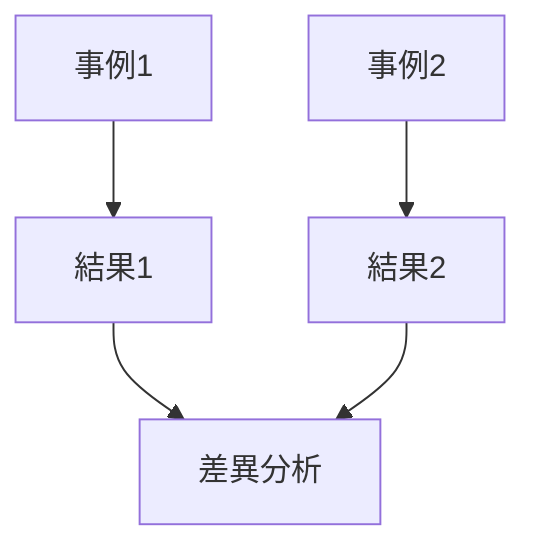

---  
layer: note  
folder: thinking_engine/reasoning/causual_reasoning  
status: stable  
updated: 2026-03-14  

---  
  
# 比較事例推論  
  
比較事例推論とは、似た事例と異なる事例を比較し、何が結果差を生んだのかを推定する推論である。  
  
単独事例では因果を断定しにくいが、比較を行うことで説明候補を絞り込める。  
これは特に歴史、政策、組織、ケース分析で有効である。  
  
---  
  
## 何を見るか  
  
- 共通条件は何か  
- 差異条件は何か  
- 結果差は何か  
- 差異条件が結果差に対応しているか  
- 見えない潜在変数がないか  
  
---  
  
## 基本構造  
  

---

## テンプレート

- 比較対象1:    
- 比較対象2:    
- 共通点:    
- 相違点:    
- 結果差:    
- 有力説明:    
- 他の候補説明:    
- 比較の限界:    

---

## 注意点

- 似ているようで比較不能な事例に注意する    
- 比較対象のスケール差を無視しない    
- 一致法と差異法を意識する