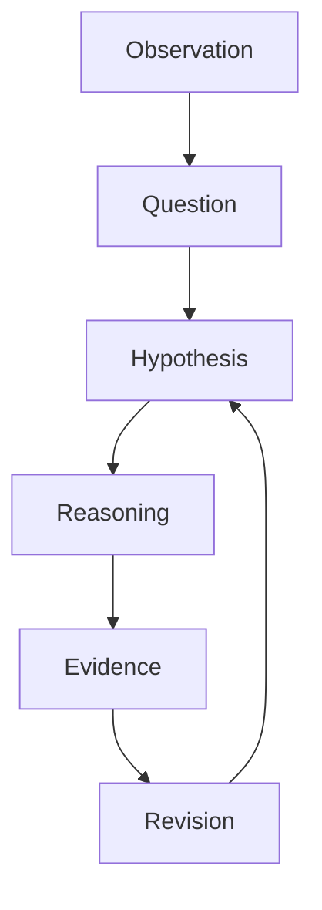

# Hypothesis

Hypothesis（仮説）は  、現象の原因・構造・関係を説明する暫定モデルである。

仮説は、
- 観察から生成され
- 推論によって検証され
- 証拠によって修正される

---

# 仮説の役割

仮説は研究・分析の中心にある。

```
Observation
   ↓
Question
   ↓
Hypothesis
   ↓
Reasoning
   ↓
Evidence
   ↓
Revision
```

---

# 仮説の基本構造

仮説は基本的に**因果関係**で書く。

```
原因 → 結果
```

例

```
高速道路建設 → 地方都市の商業衰退
```

または

```
A increases B
```

例

```
人口減少 → 公共交通衰退
```

---

# Hypothesis Types

仮説にはいくつかの種類がある。

## 1 因果仮説

原因と結果を説明する。

例

- 都市構造 → 交通混雑
- 制度設計 → 官僚行動

使用

- [[Causal Reasoning]]
- [[Mechanism Identification]]

---

## 2 構造仮説

システムの構造を説明する。

例

- 権力構造
- 市場構造
- ネットワーク構造

使用

- [[Structure Analysis]]

---

## 3 メカニズム仮説

現象を生むプロセスを説明する。

例

```
価格上昇
 ↓
需要減少
 ↓
市場調整
```

使用

- [[99_oldzettelkasten/04_knowledge_graph/Mechanism]]

---

## 4 パターン仮説

繰り返し現れる構造。

例

- 技術革新 → 既存産業崩壊
- 成功 → 模倣 → 競争

使用

- [[99_oldzettelkasten/04_knowledge_graph/Pattern]]

---

## 5 予測仮説

未来の現象を予測する。

例

- AI導入 → ホワイトカラー職減少

使用

- [[Prediction]]

---

# 仮説生成

仮説は次の方法で生成される。

### 観察

```
Observation → Hypothesis
```

例

```
地方鉄道の廃止増加
→ 人口減少が原因ではないか
```

---

### 類推

```
Similar Case → Hypothesis
```

例

```
アメリカの郊外化
→ 日本でも起きるのでは
```

---

### 理論

```
Theory → Hypothesis
```

例

```
公共財理論
→ Free Rider が発生する
```

---

# Hypothesis Evaluation

仮説は検証される必要がある。

評価基準

### 説明力

現象を説明できるか

### 予測力

未来を予測できるか

### 簡潔性

過剰に複雑でないか

### 一貫性

既存理論と矛盾しないか

---

# Hypothesis Lifecycle



---

# Thinking Engine での位置

```
Problem
   ↓
Problem Type
   ↓
Diagnostic Questions
   ↓
Hypothesis
   ↓
Reasoning
   ↓
Decision
```

---

# 関連ノート

- [[Problem Type]]
- [[Diagnostic Questions]]
- [[Causal Reasoning]]
- [[99_oldzettelkasten/04_knowledge_graph/Mechanism]]
- [[99_oldzettelkasten/04_knowledge_graph/Pattern]]
- [[Evidence]]