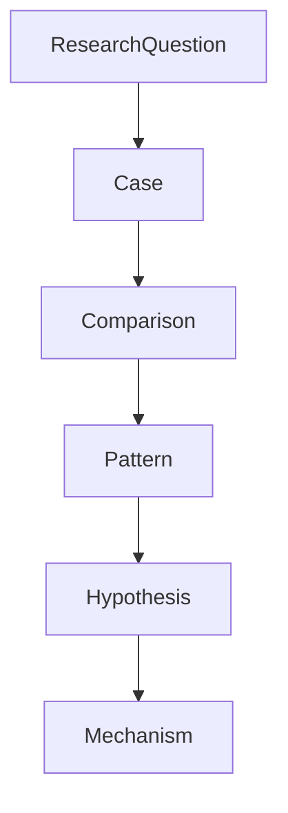

# Hypothesis

Hypothesis は Pattern と Mechanism の仮説を記述するノートである。

Hypothesis は

Research Question
↓
Case
↓
Comparison
↓
Pattern

の後に生成される。

---

# 基本構造

---

# Research Question

関連する研究問い

[[Research Question]]

---

# Hypothesis Statement

仮説を簡潔に記述する。

例

指導者の個人発言は  
メディア拡散によって政治責任問題に転化する。

---

# Supporting Cases

仮説を支持する Case

- [[Case1]]
- [[Case2]]
- [[Case3]]

---

# Counter Cases

仮説と異なる Case

- [[CaseX]]

---

# Possible Mechanisms

仮説を説明する Mechanism

- [[Mechanism A]]
- [[Mechanism B]]

---

# Predictions

仮説が正しければ起こる現象

例

- 同様の事件はメディア環境で増幅する

---

# Open Problems

未検証ポイント

- 追加 Case
- 条件