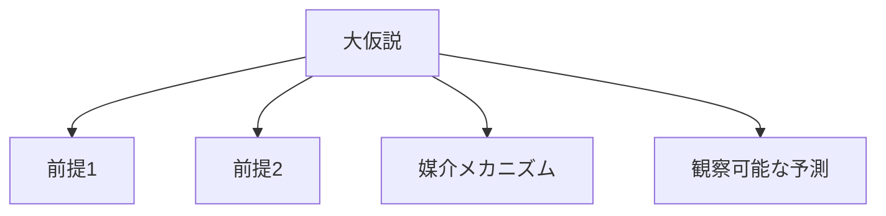

---  
layer: note  
folder: thinking_engine/reasoning/hypothesis  
status: stable  
updated: 2026-03-14  

---  
  
# 仮説分解  
  
仮説分解とは、大きすぎる仮説を、前提・メカニズム・観察可能要素に分解することである。  
  
大きな仮説は、そのままでは検証しにくい。  
そのため、「何が前提なのか」「どの経路で成立するのか」「どの部分が本当に怪しいのか」を細分化する必要がある。  
  
---  
  
## 何を見るか  
  
- 仮説の前提  
- 仮説の因果経路  
- 仮説が要求する条件  
- 観察可能な兆候  
- 反証されうる部分  
  
---  
  
## 基本構造  
  

---

## テンプレート

- 元の仮説:    
- 前提:    
- メカニズム:    
- 必要条件:    
- 予測される観察:    
- 弱い部分:    
- 分割後の小仮説:    

---

## 注意点

- 仮説全体を一括で扱わない    
- 部分ごとに証拠の強弱を分ける    
- 反証可能な部分を抽出する