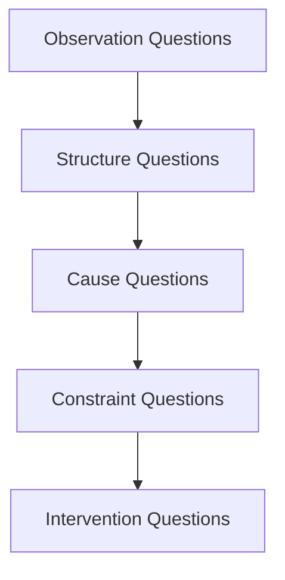

# Diagnostic Questions

問題を理解するための**診断質問セット**。  
問題の構造・原因・制約・主体を特定するために使用する。

Diagnostic Questions は以下の5層で構成される。

```
Observation
    ↓
Structure
    ↓
Cause
    ↓
Constraint
    ↓
Intervention
```

---

# 1 観察診断（Observation）

問題の**現象そのもの**を確認する。

- 何が起きているのか？
- どこで起きているのか？
- いつから起きているのか？
- どの程度の規模なのか？
- 誰が影響を受けているのか？

目的  
→ **問題の輪郭を確定する**

---

# 2 構造診断（Structure）

問題を生んでいる**構造**を探す。

- どの主体が関係しているか？
- どの制度・ルールが関係しているか？
- 情報の流れはどうなっているか？
- 権力構造はどうなっているか？
- 資源はどこに集中しているか？

目的  
→ **問題を生む構造を特定**

---

# 3 因果診断（Cause）

原因メカニズムを特定する。

- 直接原因は何か？
- 背景原因は何か？
- 行動のインセンティブは何か？
- 誰が何を得ているか？
- どのメカニズムが働いているか？

使用するノート

- [[99_oldzettelkasten/04_knowledge_graph/Mechanism]]
- [[99_oldzettelkasten/04_knowledge_graph/Pattern]]
- [[Causal Relations]]

目的  
→ **問題を動かしているメカニズムを特定**

---

# 4 制約診断（Constraint）

何が解決を妨げているのか。

- 法制度の制約はあるか
- 経済制約はあるか
- 技術制約はあるか
- 情報制約はあるか
- 認知制約はあるか

使用ノート

- [[Constraint]]
- [[Limited Rationality]]
- [[Energy Constraint]]

目的  
→ **解決の難しさの理由を理解**

---

# 5 介入診断（Intervention）

どこに介入すればよいか。

- 構造を変えるべきか
- インセンティブを変えるべきか
- 情報を変えるべきか
- 主体を変えるべきか
- 技術を導入すべきか

目的  
→ **解決可能なレバーを特定**

---

# Diagnostic Question Flow



---

# Diagnostic Questions（強化版）

## ■ 目的
問いを分類するだけでなく、
「最低限の構造情報を強制的に引き出す」

---

## ■ 基本分類（Problem Type）

- explanation（何か）
- analysis（なぜ）
- decision（どうする）
- design（設計）

---

## ■ Step1：型判定

- 「とは何か」→ explanation
- 「なぜ」→ analysis
- 「どうすれば」→ decision
- 「作れ」→ design
## ■ Step2：構造抽出質問（必須）

以下を最低1つずつ埋める：

### ① 主体（Actor）
- 誰が動いたか？
- 複数主体か？

### ② 行為（Action）
- 何をしたか？
- 1回か連続か？

### ③ 対象（Target）
- 何に対してか？

### ④ 目的（Intent）
- なぜそれをしたか？
## ■ Step3：因果の深掘り

### ■ 表層因果
- 何が起きたか？

### ■ 中間因果
- それはなぜ効いたか？

### ■ 深層因果（必須）
- 何の構造を変えたか？
## ■ Step4：転換点検出（必須）

- どこで状況が変わったか？
- 何が「決定打」だったか？
## ■ Step5：反証・違和感

- 一般的説明は何か？
- それは十分か？
- 見落としは何か？

---

## ■ 出力要件

最低限：

- 主体・行為・目的
- 3層因果
- 転換点1つ以上

---

## ■ Pattern

「浅い説明は必ず因果層が1段しかない」

---

# 関連ノート

- [[Problem Type]]
- [[Research Loop]]
- [[Thinking Engine]]
- [[Hypothesis Hub]]
- [[99_oldzettelkasten/04_knowledge_graph/Mechanism]]