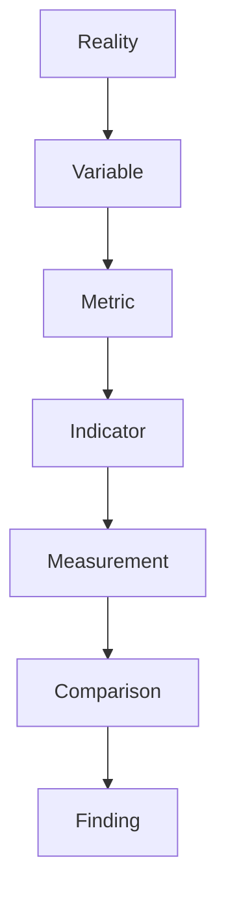

# Measurement Structure

Measurement Structure は、現実の状態を数値・指標として定量化する構造である。
Observation が現実を記述するのに対し、Measurement は現実を比較可能な尺度に変換する。

---

# 役割

Measurement は次の機能を持つ。

- 状態の定量化
- 時系列比較
- 対象間比較
- 異常検知
- 意思決定支援

---

# 思考OS内の位置
Reality  
↓  
Observation  
↓  
Signal / Noise  
↓  
Evidence  
↓  
Measurement  
↓  
Finding  
↓  
Reasoning

---

# 基本構造

# 構成要素

## Variable（測定対象）

測る対象となる現実の状態。

例
- 売上    
- 人口    
- 気温    
- GDP    
- 離職率    

---

## Metric（測定方法）

どのように測るか。

例
- 件数    
- 金額    
- 割合    
- 平均    
- 成長率    

---

## Indicator（指標）

意思決定に使える形に整理された測定値。

例
- 月次売上    
- 成長率    
- 市場シェア    
- 離職率    

---

## Measurement（計測）

実際に得られた数値。

例
- 売上1200万円
- 離職率 18%

---

## Comparison（比較）

意味を生むための比較。

比較対象
- 過去    
- 目標    
- 他組織    
- 市場平均    

---

# Measurementの4タイプ

## 状態指標

現在の状態

例
- 人口    
- 売上    
- 在庫    

---

## 変化指標

時間変化

例
- 成長率    
- 増減率    
- トレンド    

---

## 効率指標

投入と成果

例
- ROI    
- 生産性    
- 効率    

---

## リスク指標

不確実性

例
- 変動率    
- 分散    
- 不良率    

---

# Measurement設計

良いMeasurementは次を満たす。

- 定義が明確    
- 再現可能    
- 比較可能    
- 操作可能    

---

# Measurementの落とし穴

## Goodhart's Law

指標が目標になると指標が歪む。

---

## Measurement Bias

測定方法による偏り。

---

## Proxy Problem

代理指標が本質を表さない。

---

# 関連ノート

[[指標構造]]  
[[データ構造]]  
[[観察構造]]  
[[パターン構造]]  
[[シグナルノイズフィルター]]