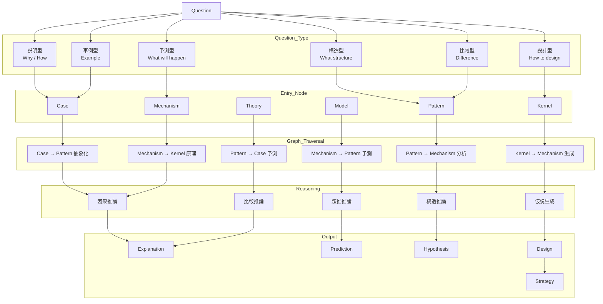

```mermaid
flowchart TB

%% =================================
%% QUESTION
%% =================================

Q[Question]

%% =================================
%% QUESTION TYPE
%% =================================

subgraph Question_Type

QT1[説明型<br>Why / How]
QT2[構造型<br>What structure]
QT3[比較型<br>Difference]
QT4[予測型<br>What will happen]
QT5[設計型<br>How to design]
QT6[事例型<br>Example]

end


%% =================================
%% ENTRY NODE
%% =================================

subgraph Entry_Node

E1[Case]
E2[Pattern]
E3[Mechanism]
E4[Kernel]
E5[Model]
E6[Theory]

end


%% =================================
%% GRAPH TRAVERSAL
%% =================================

subgraph Graph_Traversal

G1[Case → Pattern 抽象化]
G2[Pattern → Mechanism 分析]
G3[Mechanism → Kernel 原理]
G4[Kernel → Mechanism 生成]
G5[Mechanism → Pattern 予測]
G6[Pattern → Case 予測]

end


%% =================================
%% REASONING
%% =================================

subgraph Reasoning

R1[因果推論]
R2[類推推論]
R3[比較推論]
R4[構造推論]
R5[仮説生成]

end


%% =================================
%% OUTPUT
%% =================================

subgraph Output

O1[Explanation]
O2[Prediction]
O3[Hypothesis]
O4[Design]
O5[Strategy]

end


%% =================================
%% FLOW
%% =================================

Q --> QT1
Q --> QT2
Q --> QT3
Q --> QT4
Q --> QT5
Q --> QT6


QT1 --> E1
QT2 --> E2
QT3 --> E2
QT4 --> E3
QT5 --> E4
QT6 --> E1


E1 --> G1
E2 --> G2
E3 --> G3
E4 --> G4
E5 --> G5
E6 --> G6


G1 --> R1
G2 --> R4
G3 --> R1
G4 --> R5
G5 --> R2
G6 --> R3


R1 --> O1
R2 --> O2
R3 --> O1
R4 --> O3
R5 --> O4

O4 --> O5

```
