# Question → Traversal Mapping

Question → Traversal Mapping は、  
**問いの種類に応じてVaultのどのノードを辿るか**を定義するルールである。

このVaultでは、知識は Knowledge Graph として構造化されているため、  
問いの種類によって探索経路が変わる。

このノートは

・人間の思考ナビゲーション  
・LLMの推論ルール  

の両方として機能する。

---

# 基本構造

Vault Knowledge Graph

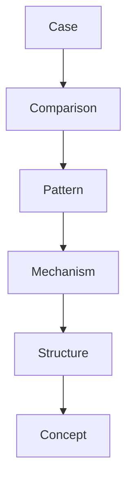

問いはこのグラフを **どの方向に辿るか** を決める。

---

# Question Type と Traversal

| Question Type | 主経路 |
|---|---|
|Exploratory | Case → Comparison → Pattern |
|Discovery | Case → Comparison → Pattern → Hypothesis |
|Hypothesis Testing | Hypothesis → Case → Comparison |
|Explanatory | Pattern → Mechanism → Structure |
|Problem Solving | Structure → Mechanism → Intervention |

---

# 1 Exploratory Question

未知の現象を理解する問い。

例

デイリーテレグラフ事件とは何か  
なぜこの企業は成功したのか

Traversal

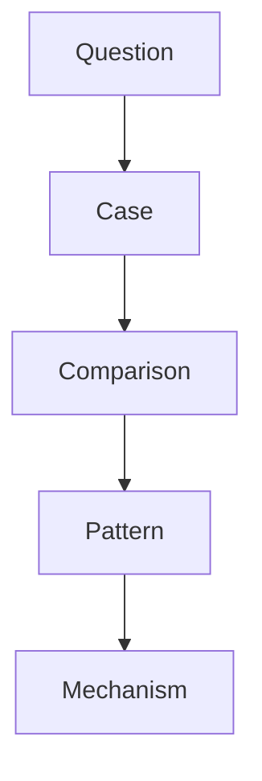

特徴

・Case収集が中心  
・Patternは後から見える  

---

# 2 Discovery Question

新しい Pattern を発見する問い。

例

政治スキャンダルには共通構造があるのか

Traversal

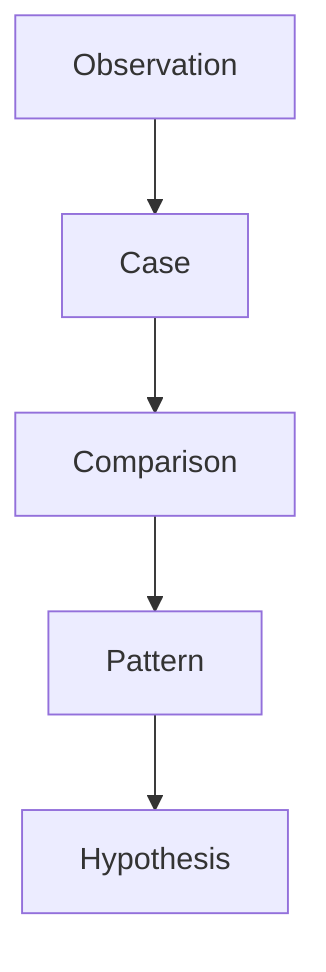

特徴

・仮説は後から生まれる  
・比較が重要  

---

# 3 Hypothesis Testing Question

仮説を検証する問い。

例

メディア拡散が政治危機を拡大させるのか

Traversal

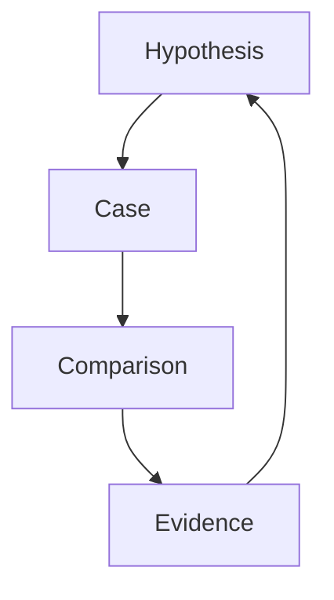

特徴

・Caseは検証材料  
・Comparisonは証拠整理  

---

# 4 Explanatory Question

Mechanismを説明する問い。

例

なぜ革命は起きるのか  
なぜ独占が形成されるのか

Traversal

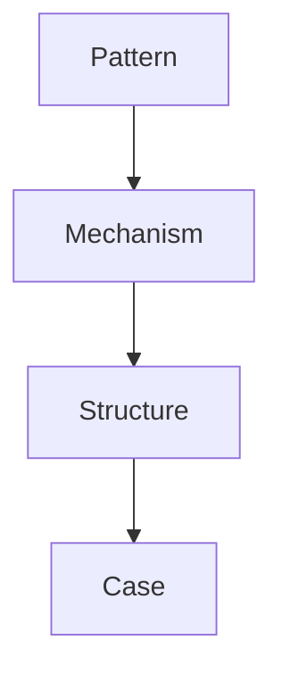

特徴

・Mechanism中心  
・Structureが重要  

---

# 5 Problem Solving Question

解決策を設計する問い。

例

どうすれば交通渋滞を減らせるか

Traversal

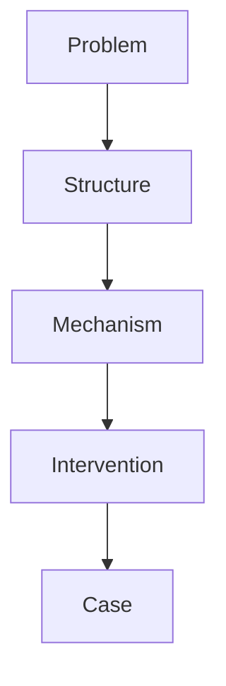

特徴

・Structure理解が必要  
・Mechanismは介入点になる  

---

# Traversal Direction

Vault探索には2方向ある。

## Bottom-up

Caseから理論へ。

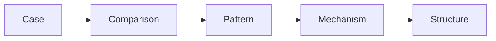

用途

・探索研究  
・現象理解  

---

## Top-down

理論から事例へ。

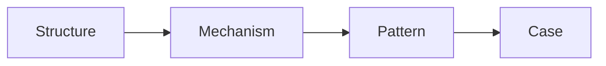

用途

・仮説検証  
・説明  

---

# Research Loop

Traversalは研究の中で循環する。

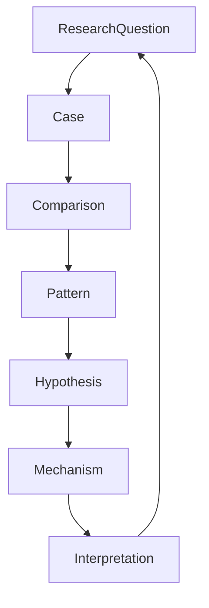

これを

**Research Loop**

と呼ぶ。

---

# LLM Traversal Rule

LLMは次の優先順位でノードを読む。

1 Research Question  
2 Case  
3 Comparison  
4 Pattern  
5 Mechanism  
6 Structure  

つまり

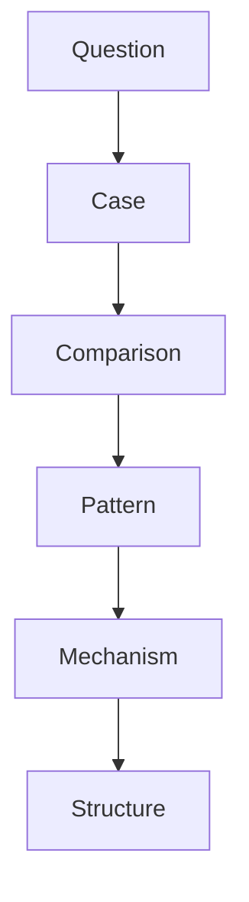

---

# Traversalの原則

## Principle 1

問いは探索経路を決める。

---

## Principle 2

Caseは常に入口になる。

---

## Principle 3

Mechanismは説明の中心になる。

---

## Principle 4

Structureは現象の制約条件になる。

---

# Vaultの思考モデル

このVaultの思考モデルは次である。

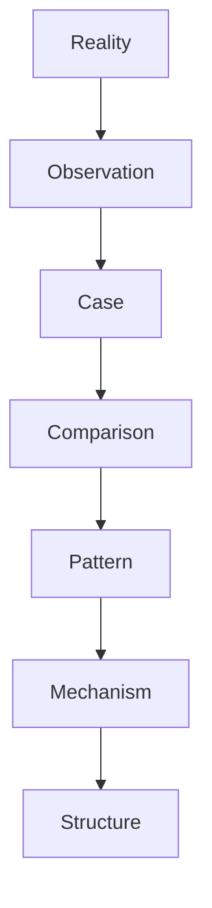

問いはこの流れを動かす。

---

# まとめ

Question → Traversal Mapping は

**問いの種類に応じてKnowledge Graphをどう辿るか**

を定義する。

したがってこのノートは

Vaultの

**思考ナビゲーション**

であり

**LLM推論ルール**

でもある。