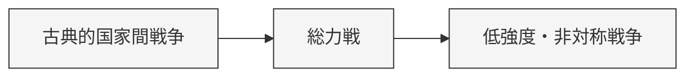

欧州大国の対外戦争の構造変化

# 概要（Concept）

欧州大国間の対外戦争は、19世紀後半以降、
コスト構造・技術・ネットワークの変化により、

«古典的国家間戦争 → 総力戦 → 低強度・非対称戦争»

へと構造的に遷移した。

これは「戦争の消滅」ではなく、最適戦略の存在領域が移動した現象である。

---

# Structure（構造遷移）

---

# 各フェーズ定義

## ① 古典的国家間戦争（〜1871）

- 主体：国家 vs 国家
- 規模：限定的
- 決定因：機動・作戦・指揮官
- 期間：短期
- 例：ナポレオン戦争、普仏戦争

---

## ② 総力戦（1914–1945）

- 主体：国家ブロック vs 国家ブロック
- 規模：全人口・全産業動員
- 決定因：生産力・資源・同盟
- 期間：長期
- 例：第一次世界大戦、第二次世界大戦

---

## ③ 低強度・非対称戦争（1945以降）

- 主体：国家 vs 非国家主体 / 代理勢力
- 規模：局地的
- 決定因：レバレッジ・情報・心理
- 期間：長期・断続的
- 例：内戦、テロ、代理戦争

---

# Mechanism（遷移メカニズム）

## ① コスト構造の変化

戦争コストの増大により：

- 限定戦争 → 総力戦
- 総力戦 → 抑止・回避

---

## ② 技術変化

- 工業化 → 総力戦を可能に
- 核兵器 → 直接戦争を抑止
- 情報技術 → 非対称戦争を強化

---

## ③ ネットワーク拡大

- 同盟のスケール化
- EU・NATOによる統合

→ 国家間戦争のハードル上昇

---

## ④ フィードバック抑制

- 国際制度が戦争拡大を制限
- 経済相互依存が抑止として機能

---

## ⑤ 形態変換（重要）

高コスト領域（国家戦争） → 低コスト領域（非対称戦）

---

# Kernel（抽象原理）

- [[コスト最適化]]
- [[02_zettelkasten/01_knowledge/world_model/kernel/physics/フィードバック原理|フィードバック原理]]]
- [[02_zettelkasten/01_knowledge/world_model/mechanism/information/情報非対称メカニズム|情報非対称メカニズム]]
- [[02_zettelkasten/01_knowledge/world_model/kernel/complex/ネットワーク原理|ネットワーク原理]]
- [[非線形原理]]

---

Caseリンク

- 普仏戦争（古典的戦争の最終典型）
- 第一次世界大戦（総力戦の確立）
- 第二次世界大戦（総力戦の極限）
- 冷戦（直接戦争の抑止）
- 現代紛争（非対称戦）

---

Cross Domain Mapping

ビジネス

価格競争 → 規模競争 → プラットフォーム競争

---

組織

直接対立 → 総力競争 → 情報戦・影響力戦

---

重要な洞察

戦争は消えていない。

«「勝てない戦い」は選ばれなくなり、
「勝てる戦い」の形に変わっただけである。»