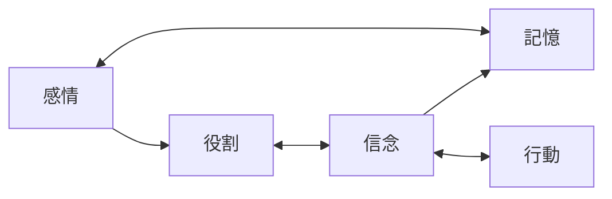

# アイデンティティ構造

## 概要
自己は固定されたものではなく、複数の構造の集合である

---

## 構成要素

### 1. 役割（Role）
- 社会的立場
- 職業
- 所属

---

### 2. 信念（Belief）
- 世界観
- 常識
- 正しさの基準

---

### 3. 記憶（Memory）
- 過去の経験
- 成功・失敗

---

### 4. 感情（Emotion）
- 好き嫌い
- 恐れ
- 欲求

---

### 5. 行動パターン（Behavior）
- 習慣
- 意思決定スタイル

---

## 構造図（概念）

---

## 変容ポイント

旅では以下が変化する：

- 信念
- 行動パターン
- 自己定義

---

## 注意

役割は変えやすいが  
信念は変えにくい

→ 旅の主戦場は信念層