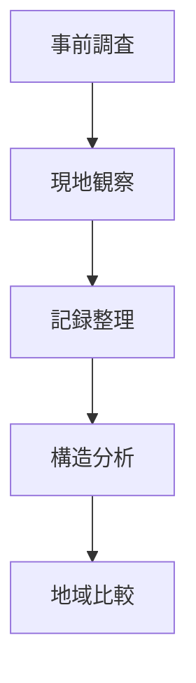
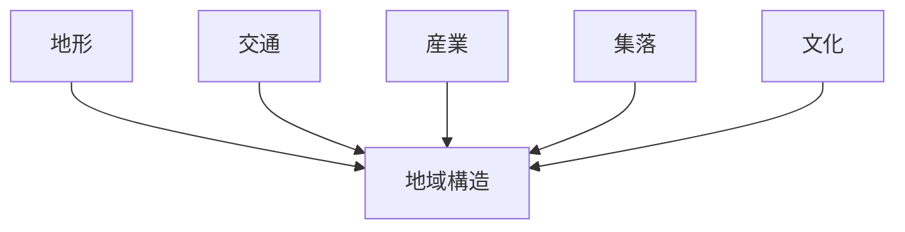
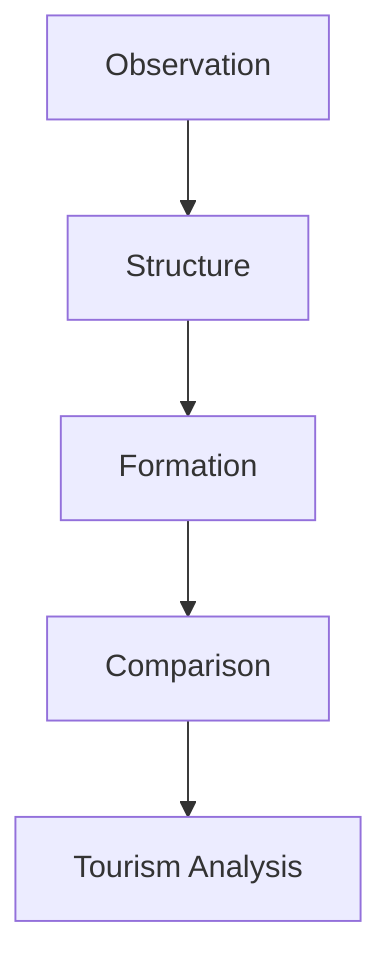

# Fieldwork Execution Hub（フィールドワーク実行）

## 概要

フィールドワーク実行とは  
**現地観察を通して地域構造と地域形成を理解する調査プロセス**である。

フィールドワークでは

- 観察
- 記録
- 分析
- 比較

を段階的に行う。

---

# フィールドワークの基本プロセス

---

# フィールドワークの段階

## 1 事前調査

目的

調査対象地域の基本情報を理解する。

確認事項

- 地形
- 交通
- 歴史
- 産業

---

## 2 現地観察

現地で観察する。

観察対象

- 地形
- 交通
- 産業
- 集落
- 文化

関連ノート

- [[地域地形観察]]
- [[地域交通観察]]
- [[地域産業観察]]
- [[地域集落観察]]
- [[地域文化観察]]

---

## 3 記録整理

現地観察を整理する。

記録方法

- 写真
- 地図
- メモ

---

## 4 構造分析

地域構造を理解する。

関連ノート

- [[Regional Structure Hub]]
- [[Regional Formation Hub]]

---

## 5 比較分析

他地域と比較する。

関連ノート

- [[Regional Comparison Hub]]

---

# フィールドワーク観察フレーム

---

# フィールドワーク質問

1 この地域の地形は何か  
2 交通はどこを通るか  
3 産業は何か  
4 集落はどこにあるか  
5 文化は何か  

---

# フィールドワークの成果

フィールドワークによって

- 地域構造理解
- 地域形成理解
- 観光分析

が可能になる。

---

# フィールドワーク研究の流れ

---

# 関連ノート

- [[Regional Structure Hub]]
- [[Regional Formation Hub]]
- [[Regional Comparison Hub]]
- [[Regional Tourism Analysis Hub]]
- [[都市構造分析]]