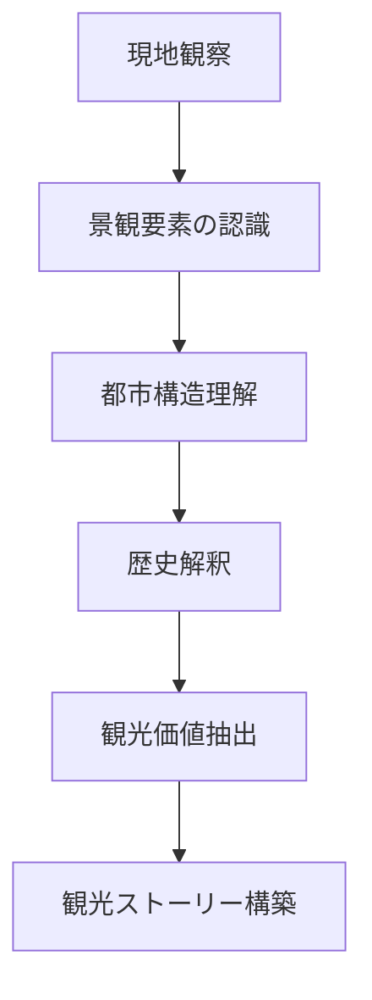
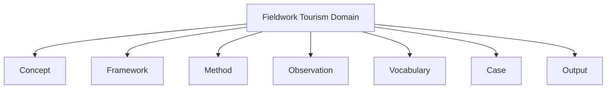
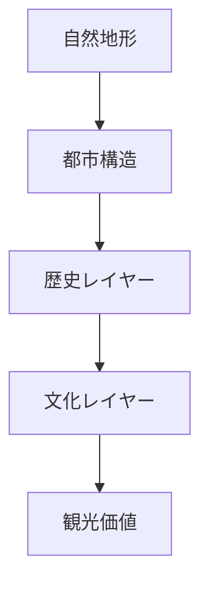

# Fieldwork Tourism Hub

## 概要

フィールドワークツーリズムは  
**現地観察を通じて都市・地域の構造を理解し、観光価値を発見する研究・実践分野**である。

このDomainは以下を統合する。

- 地理観察
- 都市構造理解
- 歴史景観理解
- 観光価値発見
- ツアー設計

---

## Fieldwork Tourism の基本サイクル

---

# このDomainの構造

---

# Concept（概念）
都市や地域を理解するための思考概念。
例
- [[02_zettelkasten/01_knowledge/domain/photography/photo_fieldwork/フィールドワーク観察]]
- [[景観読解]]
- [[都市レイヤー]]
- [[場所性]]

---

# Framework（分析フレーム）
街を分析するための骨格。
例
- [[町読みフレーム]]
-  [[観光地分析フレーム]]
- [[都市構造分析フレーム]]

---

### Method（方法）
具体的分析技術。
例
- [[地図読解法]]
- [[古地図比較]]
- [[街区分析]]

---

# Observation（観察）
現地調査のチェックリスト。
例
- [[フィールドワークチェックリスト]]
- [[02_zettelkasten/01_knowledge/domain/fieldwork_tourism/04_method/07_observation/05_urban_observation/都市観察チェックリスト]]
[[景観観察チェックリスト]]

---

# Vocabulary（用語）
都市・地理・観光の専門用語。
例
- [[城下町]]
- [[河岸段丘]]
- [[寺町]]

--- 

# Case（事例）
具体的フィールドワーク。

---

# Output（成果）
フィールドワークのアウトプット。
例
- [[観光地分析レポート]]
- [[観光ルート設計]]
- [[観光地ストーリー]]

---

# Fieldwork Tourism の思考モデル
都市観察の基本構造

# このDomainの目的
このDomainは以下の能力を作る。
- 街を見ただけで構造を理解する
- 観光価値を発見する
- 地域ストーリーを語る
- ツアーを設計する

---

# 関連Domain
- [[地理学]]
- [[都市研究]]
- [[観光研究]]