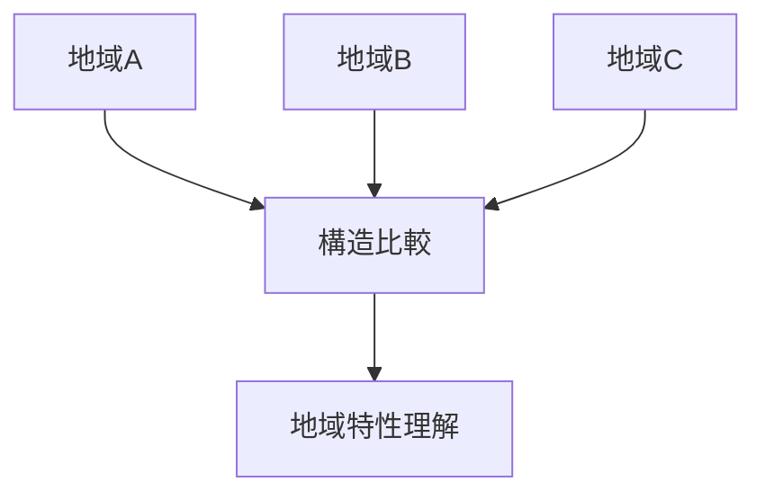
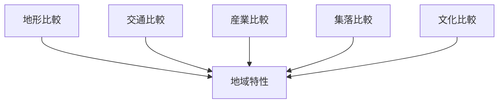
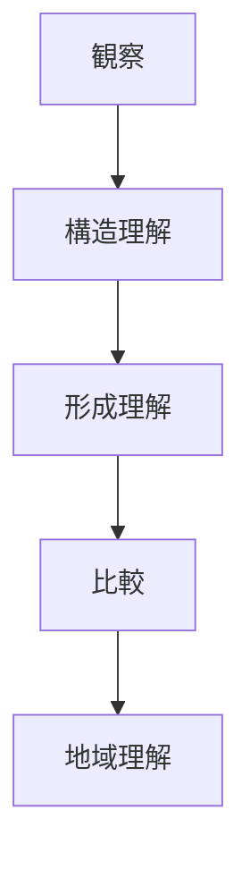

# Regional Comparison Hub（地域比較）

## 概要

地域比較とは  
**複数の地域の構造・形成・文化を比較し、地域特性を理解する方法**である。

地域比較によって

- 地域の個性
- 地域形成のパターン
- 観光資源

を理解できる。

---

# 地域比較の基本構造

---

# 比較要素

地域比較では以下を比較する。

| 要素 | 内容 |
|---|---|
| 地形 | 山地・平野・海岸 |
| 交通 | 街道・鉄道・港 |
| 産業 | 農業・漁業・工業 |
| 集落 | 村落・城下町・港町 |
| 文化 | 宗教・祭礼・景観 |

---

# 比較フレーム

---

# 比較の目的

地域比較の目的は

- 地域特性理解
- 地域形成パターン理解
- 観光分析

である。

---

# 比較方法

1 地形を比較する  
2 交通を比較する  
3 産業を比較する  
4 集落を比較する  
5 文化を比較する  

---

# 比較例

## 城下町比較

| 地域 | 特徴 |
|---|---|
| 金沢 | 城下町 |
| 松本 | 山城下町 |
| 会津若松 | 武家都市 |

---

## 港町比較

| 地域 | 特徴 |
|---|---|
| 長崎 | 国際港 |
| 神戸 | 貿易港 |
| 函館 | 開港都市 |

---

## 宿場町比較

| 地域 | 特徴 |
|---|---|
| 妻籠 | 山間宿場 |
| 馬籠 | 街道宿場 |
| 奈良井 | 中山道宿場 |

---

# 地域研究の流れ

---

# 関連ノート

- [[Regional Structure Hub]]
- [[Regional Formation Hub]]
- [[都市比較フレーム]]
- [[観光景観評価]]