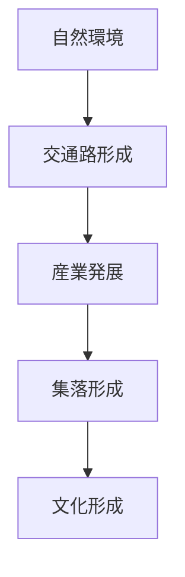
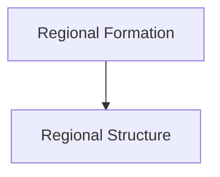

# Regional Formation Hub（地域形成プロセス）

## 概要

地域形成とは  
**自然環境と人間活動が時間をかけて地域を形成していく過程**である。

地域は

- 地形
- 交通
- 産業
- 集落
- 文化

の相互作用によって歴史的に形成される。

地域形成を理解すると

- 地域の歴史
- 空間構造
- 観光資源

を理解できる。

---

# 地域形成の基本モデル



自然環境が基盤となり  
交通が生まれ  
産業が発展し  
集落が形成され  
文化が形成される。

---

# 地域形成の段階

## 1 自然段階

特徴

- 地形
- 河川
- 気候

例

- 平野
- 盆地
- 海岸

---

## 2 交通段階

特徴

- 街道
- 港
- 鉄道

例

- 宿場町
- 港町

---

## 3 産業段階

特徴

- 農業
- 漁業
- 工業

例

- 農村
- 工業都市

---

## 4 集落段階

特徴

- 村落
- 都市

例

- 城下町
- 宿場町

---

## 5 文化段階

特徴

- 宗教
- 祭礼
- 景観

例

- 門前町
- 観光地

---

# 地域形成の時間構造


---

# フィールドワーク分析

地域形成分析では以下を考える。

1 地形は何か  
2 交通はどのように形成されたか  
3 産業は何か  
4 集落はどのように形成されたか  
5 文化は何か  

---

# 地域形成の例

## 城下町型

```
平野
↓
街道
↓
城
↓
城下町
↓
文化都市
```

例

- 金沢
- 松本

---

## 港町型

```
海岸
↓
港
↓
貿易
↓
港町
↓
国際文化
```

例

- 長崎
- 神戸

---

## 宿場町型

```
街道
↓
宿場
↓
商業
↓
町
↓
観光地
```

例

- 妻籠
- 馬籠

---

# Regional Structureとの関係



地域形成プロセスが  
地域構造を生む。

---

# 関連ノート

- [[Regional Structure Hub]]
- [[地域地形観察]]
- [[地域交通観察]]
- [[地域産業観察]]
- [[地域集落観察]]
- [[地域文化観察]]