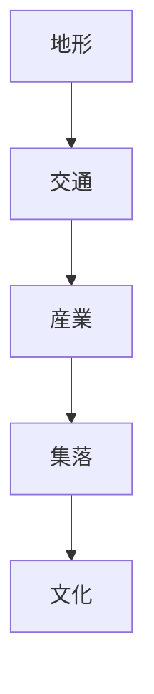
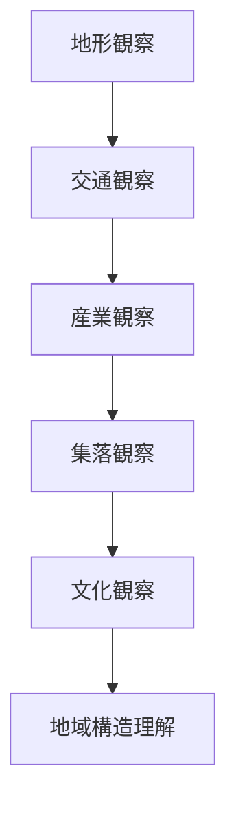
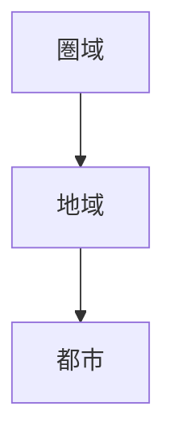

# Regional Structure Hub（地域構造）

## 概要

地域構造とは  
**自然環境と人間活動が相互作用して形成される地域の構造**である。

地域は

- 地形
- 交通
- 産業
- 集落
- 文化

という要素によって構成される。

これらを観察すると  
地域形成と地域特性を理解できる。

---

# 地域構造の基本モデル

地形が交通を規定し  
交通が産業を生み  
産業が集落を形成し  
集落が文化を生む。

---

# 地域観察との対応

| 要素 | 観察ノート |
|---|---|
| 地形 | [[地域地形観察]] |
| 交通 | [[地域交通観察]] |
| 産業 | [[地域産業観察]] |
| 集落 | [[地域集落観察]] |
| 文化 | [[地域文化観察]] |

---

# 地域分析手順

---

# 地域構造のタイプ

## 山地地域

特徴

- 林業
- 山村

---

## 平野地域

特徴

- 農業
- 都市

---

## 海岸地域

特徴

- 漁業
- 港町

---

## 盆地地域

特徴

- 城下町
- 内陸都市

---

# フィールドワーク質問

1 この地域の地形は何か  
2 交通はどこを通るか  
3 産業は何か  
4 集落はどこにあるか  
5 文化は何か  

---

# 分析の目的

地域構造分析の目的は

- 地域形成理解
- 地域特性理解
- 観光資源理解

である。

---

# スケール関係

地域は  
圏域と都市の中間スケールである。

---

# 関連ノート

- [[地域地形観察]]
- [[地域交通観察]]
- [[地域産業観察]]
- [[地域集落観察]]
- [[地域文化観察]]
- [[都市構造分析]]