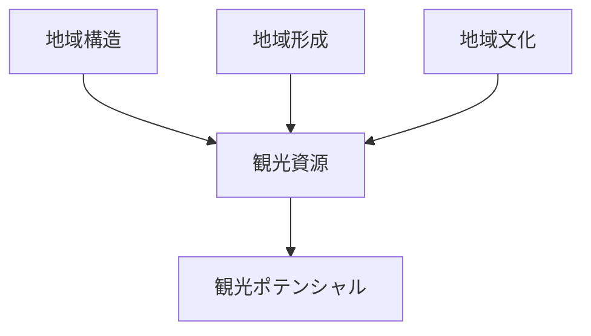
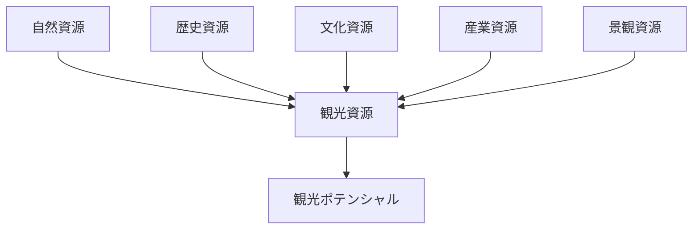
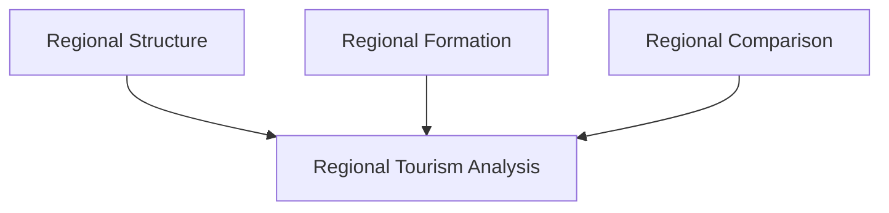

# Regional Tourism Analysis Hub（地域観光分析）

## 概要

地域観光分析とは  
**地域構造・地域形成・地域文化を分析し、観光資源と観光ポテンシャルを評価する方法**である。

地域の観光価値は

- 自然環境
- 歴史
- 文化
- 景観

によって形成される。

地域研究の成果を観光分析に接続することで  
観光資源の理解と観光戦略の設計が可能になる。

---

# 観光分析の基本構造



---

# 観光資源の要素

| 要素 | 内容 |
|---|---|
| 自然 | 山・海・川・景観 |
| 歴史 | 城・町並み・遺跡 |
| 文化 | 神社・祭礼・食文化 |
| 産業 | 農業・工業・特産品 |
| 景観 | 都市景観・農村景観 |

---

# 観光分析フレーム



---

# 観光ポテンシャル評価

観光ポテンシャルは

- 独自性
- アクセス
- 景観価値
- 歴史価値
- 文化価値

によって評価される。

---

# フィールドワーク質問

1 この地域の自然資源は何か  
2 この地域の歴史資源は何か  
3 この地域の文化資源は何か  
4 観光客は何を体験できるか  

---

# 観光分析の例

## 城下町型観光

```
城
↓
城下町
↓
町並み
↓
観光都市
```

例

- 金沢
- 松本

---

## 温泉型観光

```
温泉
↓
旅館
↓
温泉街
↓
観光地
```

例

- 箱根
- 草津

---

## 景観型観光

```
自然景観
↓
展望地
↓
観光施設
↓
観光地
```

例

- 上高地
- 富士山

---

# 地域研究との関係



---

# 関連ノート

- [[Regional Structure Hub]]
- [[Regional Formation Hub]]
- [[Regional Comparison Hub]]
- [[観光景観評価]]
- [[都市観光分析]]