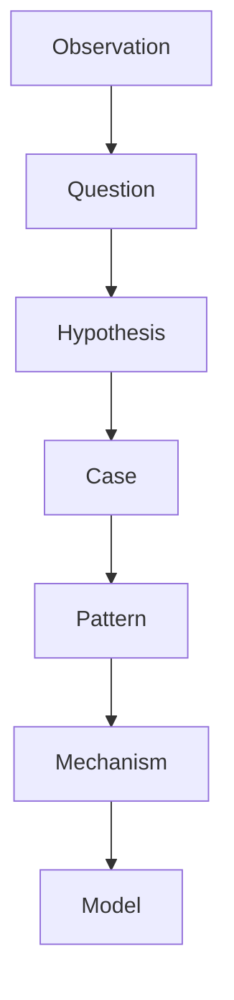
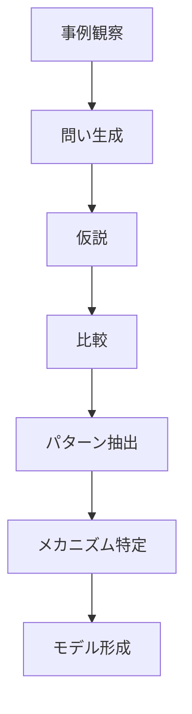
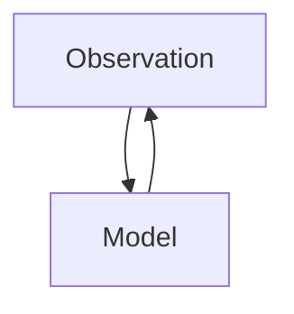
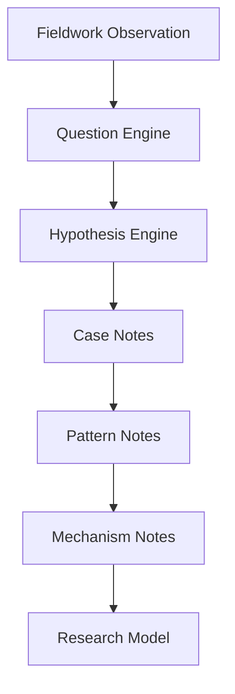

# Research Abstraction Hub（研究抽象化）

## 概要

Research Abstractionとは  
**観察された事例を抽象化し、一般的な知識体系へ昇華する研究プロセス**である。

研究では

Observation → Question → Hypothesis → Case → Pattern → Mechanism → Model

という抽象化階層を通して  
知識が形成される。

---

# 抽象化階層

---

# 各層の意味

## Observation

現地観察。

例

- 街道沿いの町
- 城の存在
- 港湾地区

関連

- [[地域地形観察]]
- [[地域交通観察]]
- [[都市観察]]

---

## Question

観察から生まれる問い。

例

- なぜここに町があるのか  
- なぜこの場所に港があるのか  

関連

- [[Fieldwork Question Engine]]

---

## Hypothesis

問いに対する仮説。

例

- この町は宿場町ではないか  
- この都市は城下町ではないか  

関連

- [[Fieldwork Hypothesis Engine]]

---

## Case

個別事例。

例

- 金沢
- 松本
- 妻籠
- 長崎

Caseは  
**具体的な現象の記録**である。

---

## Pattern

複数事例に共通する構造。

例

- 城を中心とした都市構造
- 港を中心とした商業地区
- 街道沿いの宿場町

Patternは  
**繰り返し現れる形**である。

---

## Mechanism

なぜそのパターンが生じるのか。

例

- 防御
- 交通効率
- 政治統制
- 物流集中

Mechanismは  
**因果関係の説明**である。

---

## Model

パターンとメカニズムを統合した一般理論。

例

- 城下町モデル
- 港町モデル
- 宿場町モデル

Modelは  
**事例を説明する理論装置**である。

---

# 抽象化プロセス

---

# 研究思考の循環

モデルは  
新しい観察を導く。

---

# Vault内の位置

---

# このHubの役割

このHubは

- Vaultの知識階層を整理する
- 研究思考の構造を明確にする
- Case / Pattern / Model を接続する

中心ノードである。

---

# 関連ノート

- [[Fieldwork Question Engine]]
- [[Fieldwork Hypothesis Engine]]
- [[Model Extraction Engine]]
- [[Pattern Extraction Method 1]]
- [[Mechanism Identification]]