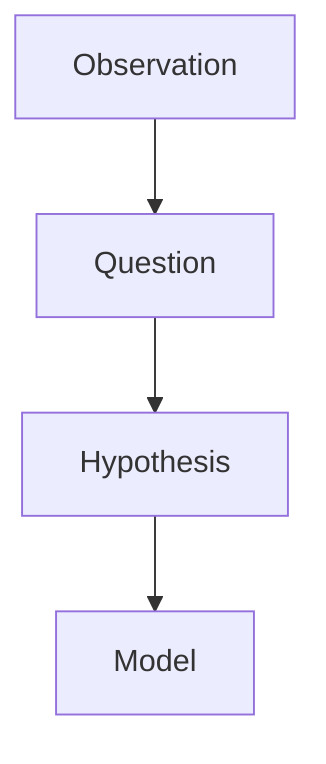
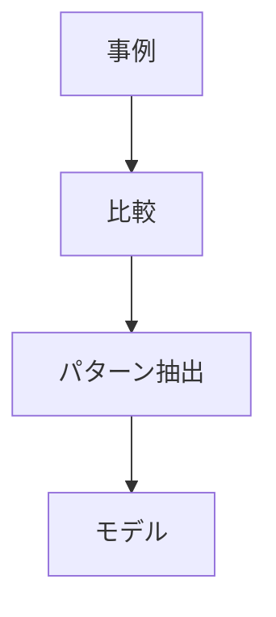
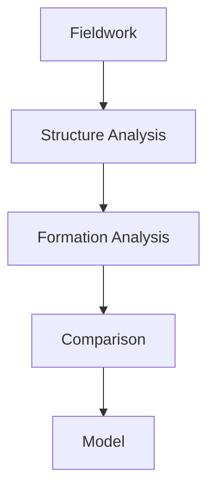

# Research Model Layer（研究モデル層）

## 概要

Research Model Layerとは  
**フィールドワークで得られた知見を一般化し、地域や都市のモデルとして整理する層**である。

フィールドワーク研究では

観察 → 問い → 仮説 → モデル

という段階を経て  
地域理解を理論化する。

---

# 研究思考構造



---

# モデルの役割

モデルは

- 現象の理解
- パターンの説明
- 予測

に使われる。

---

# モデルの種類

## 都市モデル

都市構造や都市形成を説明するモデル。

例

- 城下町モデル
- 港町モデル
- 宿場町モデル

---

## 地域モデル

地域構造を説明するモデル。

例

- 平野農業地域
- 山地林業地域
- 沿岸漁業地域

---

## 観光モデル

観光地域形成を説明するモデル。

例

- 温泉観光モデル
- 城下町観光モデル
- 景観観光モデル

---

# モデル形成プロセス



---

# モデル作成手順

1 フィールドワーク事例を集める  
2 地域構造を比較する  
3 共通パターンを抽出する  
4 モデルとして整理する  

---

# モデル例

## 城下町モデル

```
城
↓
武家地
↓
町人地
↓
寺町
```

---

## 港町モデル

```
港
↓
商業地区
↓
居住地区
```

---

## 宿場町モデル

```
街道
↓
宿場
↓
商業
```

---

# 研究の流れ



---

# 関連ノート

- [[Fieldwork Question Engine]]
- [[Fieldwork Hypothesis Engine]]
- [[Regional Structure Hub]]
- [[Regional Formation Hub]]
- [[Regional Comparison Hub]]