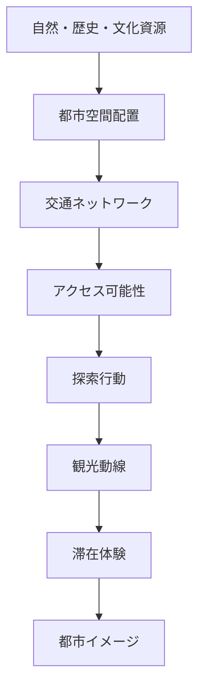
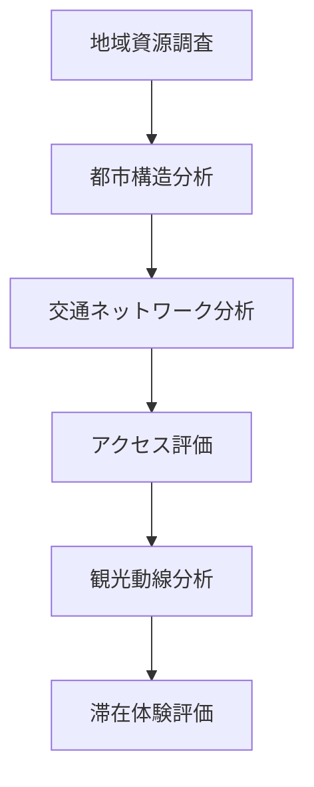

# 都市探索OS

都市探索OSとは、都市・地域を理解するための知識体系であり、  
**都市構造・交通・観光資源・人間行動を統合して都市体験を分析するフレームワーク**である。

このOSでは都市を

**資源 → 空間配置 → 交通 → 探索 → 滞在体験**

という連鎖として理解する。

---

# 基本モデル



---

# OSの構造

都市探索OSは5つの層で構成される。

```
都市探索OS
├ concept
├ structure
├ mechanism
├ method
└ domain
```

---

# 1 Concept（概念）

都市探索の基本概念。

```
concept
└ urban_exploration
   ├ 観光体験
   ├ 観光の視線
   ├ 観光動線
   ├ 都市イメージ
   ├ 都市探索
```

---

# 2 Structure（構造）

都市や観光体験の構造モデル。

```
structure
├ tourism
│  ├ 観光地探索レベル
│  ├ 観光地探索難易度
│  ├ 観光体験満足度構造
│  └ 舞台裏理論
│
├ urban
│  ├ 都市構造
│  ├ 拠点構造
│  └ 空間配置構造
│
└ transport
   ├ 交通ネットワーク構造
   ├ アクセス構造
   └ 乗換構造
```

---

# 3 Mechanism（メカニズム）

都市や観光が成立する仕組み。

```
mechanism
├ tourism
│  └ 観光地発生メカニズム
│
├ urban
│  └ 都市形成メカニズム
│
└ transport
   └ 交通需要発生メカニズム
```

---

# 4 Method（分析手法）

都市や観光を分析する方法。

```
method
└ tourism_analysis
   ├ 観光地抽出方法
   ├ 観光都市評価軸
   ├ 滞在時間3軸算出方法
   ├ 滞在時間5軸算出方法
   ├ 場所時間マトリクス
```

---

# 5 Domain（具体知識）

フィールドワークで使う具体的知識。

```
domain
└ geography
   ├ ランドマーク分析
   ├ 河川分析
   ├ 街区分析
   └ 地形分析
```

---

# 都市探索の分析フロー

都市探索は次の順序で行われる。



---

# 都市探索の典型パターン

## 駅前集中型都市
駅周辺に観光資源が集中。

特徴  
- 徒歩回遊可能  
- 鉄道旅行向き  

例  
- 金沢  
- 京都  

---

## 分散型観光地
資源が広域に分散。

特徴  
- 自動車依存  
- 公共交通では回りにくい  

例  
- 高原観光地  

---

## 移動体験型観光
交通自体が観光資源。

例  
- ローカル線  
- 山岳鉄道  

---

## 大都市回遊型
都市鉄道を使って観光。

例  
- 東京  
- パリ  

---

# このOSで扱える問い

- なぜ同じ観光資源量でも滞在時間が違うのか  
- なぜ地方都市は駅前が弱いと観光で不利なのか  
- なぜローカル線は観光資源になる場合があるのか  
- なぜ都市観光では交通理解が重要なのか  

---

# 関連ノート

- [[観光分析OS Hub]]
- [[都市構造]]
- [[交通ネットワーク構造]]
- [[観光地探索難易度]]
- [[観光地発生メカニズム]]
- [[観光都市評価軸]]

---

# 要約

都市探索OSとは、

**都市を「資源・空間・交通・探索・体験」の連鎖として理解する知識システム**である。

このOSを使うことで、都市や観光地を

**直感ではなく構造として理解することができる。**