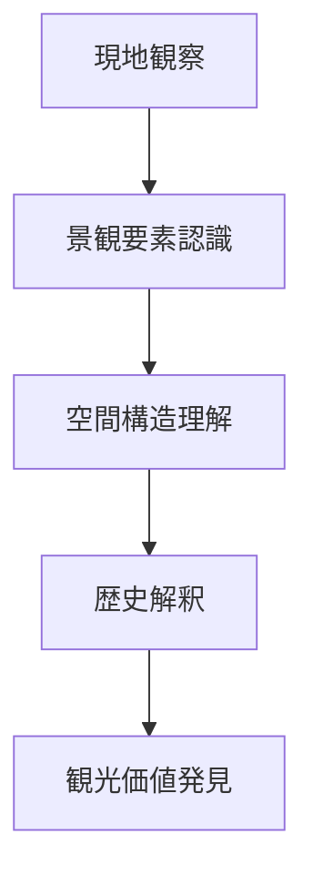
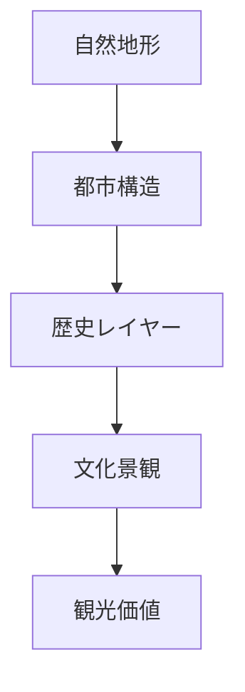

# フィールドワーク観察

## 概要

フィールドワーク観察とは、  
**現地において空間・景観・人間活動を直接観察し、地域の構造を理解する行為**である。

観光研究・地理学・都市研究では、  
机上の情報よりも **現地観察を基盤とした理解**が重視される。

フィールドワーク観察の目的は次の三つである。

- 地域の構造を理解する
- 景観要素を認識する
- 観光価値を発見する

---

## フィールドワーク観察の基本構造

フィールドワークは次の思考プロセスで進む。

---

# 観察の対象
フィールドワーク観察では以下の要素を観察する。
## 1 自然要素
- 地形
- 河川
- 海岸
- 山地
- 台地
- 植生
これらは都市形成の基盤となる。
例
- 河岸段丘
- 扇状地
- 自然堤防
## 2 空間構造
都市や集落の構造。
例
- 街路構造
- 街区構造
- 建築配置
- 都市軸
## 3 景観要素
景観を構成する要素。
例
- 建築
- 看板
- 道路
- 橋
- 寺社
- 商店
## 4 人間活動
地域の生活や経済活動。
例
- 商業活動
- 観光行動
- 交通流
- 生活景観
- 観察の階層
フィールドワーク観察は階層的に行う。

---

# フィールドワーク観察の視点
## 地形視点
- 台地
- 河岸段丘
- 扇状地
- 谷地形
都市の成立条件を理解する。
## 歴史視点
- 城
- 宿場町
- 港町
- 門前町
都市の歴史構造を理解する。
## 景観視点
- 建築
- 景観軸
- ランドマーク
都市の視覚構造を理解する。
## 観光視点
- 観光動線
- 観光拠点
- 観光資源
- 観光価値を理解する。

---

# フィールドワーク観察の方法
フィールドワーク観察は次の順序で行う。
1. 地形を理解する
2. 都市構造を理解する
3. 歴史構造を理解する
4. 景観構造を理解する
5. 観光価値を抽出する
例：金沢
## 観察
- 卯辰山
- 浅野川
- 小立野台地
- 犀川
- 寺町台地
## 構造
- 河岸段丘都市
- 城下町
- 観光価値
- 武家文化
- 寺町文化
- 城下町景観

---

# フィールドワーク観察の目的
この概念の最終目的は次である。
- 地域構造を理解する
- 観光資源を発見する
- 地域ストーリーを語る

---

# 関連ノート
- [[景観読解]]
- [[都市レイヤー]]
- [[町読みフレーム]]
- [[フィールドワークチェックリスト]]
