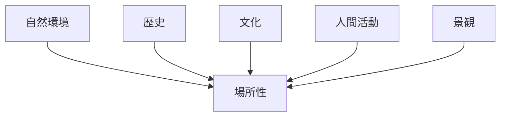
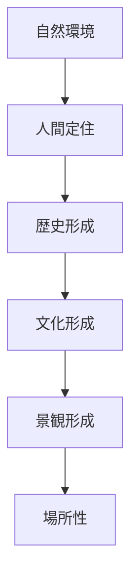
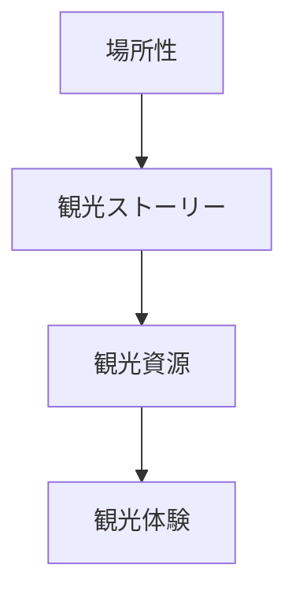

# 場所性（Sense of Place）

## 概要

場所性（Sense of Place）とは  
**特定の場所が持つ独特の雰囲気・意味・感情的価値**を指す概念である。

場所は単なる空間ではなく、  
人間の経験・文化・歴史によって意味づけられる。

その結果、

- その場所らしさ
- その場所への愛着
- その場所への記憶

が生まれる。

これを **場所性**と呼ぶ。

---

## 場所性の構造

---

## 場所性を構成する要素

### 自然環境

場所の自然条件。

例

- 山
- 海
- 河川
- 森林

自然環境は場所の雰囲気を形成する。

---

### 歴史

場所の歴史的背景。

例

- 城
- 古道
- 遺跡
- 古い街並み

歴史は場所に時間の深みを与える。

---

### 文化

地域文化。

例

- 祭り
- 伝統工芸
- 食文化

文化は場所の意味を形成する。

---

### 人間活動

現在の生活や社会活動。

例

- 商店
- 市場
- 観光

生活の存在が場所を生きた空間にする。

---

### 景観

場所の視覚構造。

例

- 建築
- 景観軸
- ランドマーク

景観は場所性を視覚的に表現する。

---

## 場所性の形成

場所性は長い時間をかけて形成される。

---

## フィールドワークでの使い方

フィールドワークでは次を観察する。

1 この場所の自然環境  
2 この場所の歴史  
3 この場所の文化  
4 この場所の生活  

これらを統合すると  
場所性が理解できる。

---

## 例

### 京都

自然

- 山に囲まれた盆地

歴史

- 千年の都

文化

- 寺院
- 伝統文化

景観

- 歴史建築
- 庭園

場所性

**歴史文化都市**

---

### 鎌倉

自然

- 三方を山に囲まれる

歴史

- 武家政権

文化

- 禅寺

景観

- 谷戸地形
- 寺院

場所性

**武家文化都市**

---

## 観光との関係

観光は場所性を体験する行為である。

場所性が強い場所ほど  
観光価値が高くなる。

---

## 場所性の目的

この概念の目的は次である。

- 地域の意味を理解する  
- 観光価値を発見する  
- 地域ストーリーを構築する  

---

## 関連ノート

- [[都市アイデンティティ]]
- [[景観読解]]
- [[観光地分析フレーム]]
- [[観光ストーリー構築フレーム]]