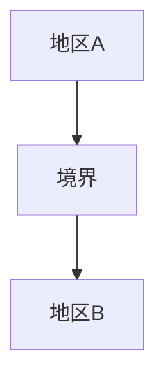

# 境界（都市エッジ）

## 概要

境界とは  
**都市空間を区切る線的要素**である。

都市では

- 河川
- 崖
- 鉄道
- 高速道路
- 城壁
- 外堀

などが都市の境界を形成する。

Kevin Lynch の理論では  
**edge** と呼ばれる。

---

# 境界の基本構造

境界は  
**都市の地区を分ける要素**である。

---

# 境界の種類

## 自然境界

例

- 河川
- 崖
- 海岸
- 山

特徴

自然地形による都市区分。

---

## 人工境界

例

- 鉄道
- 高速道路
- 城壁
- 外堀

特徴

都市構造や防御。

---

## 景観境界

例

- 高層地区 → 低層地区
- 商業地区 → 住宅地区

特徴

都市景観の変化。

---

# 境界の役割

境界は都市に

- 空間区分
- 都市構造
- 景観変化

を生む。

---

# フィールドワーク質問

1 都市はどこで区切られているか  
2 河川や鉄道は都市構造にどう影響するか  
3 境界の両側で何が変わるか  
4 境界は人流をどう変えるか  

---

# 観察ポイント

- 河川
- 崖
- 鉄道
- 高速道路

---

# 例

## 城下町

境界

外堀

特徴

防御と都市区分。

---

## 河岸都市

境界

河川

特徴

都市活動境界。

---

## 鉄道都市

境界

鉄道線

特徴

都市分断。

---

# Kevin Lynch 理論

| Lynch | 空間概念 |
|---|---|
| edge | 境界 |

---

# 関連ノート

- [[境界観察]]
- [[都市エッジ観察]]
- [[河川観察]]
- [[土地利用分析]]