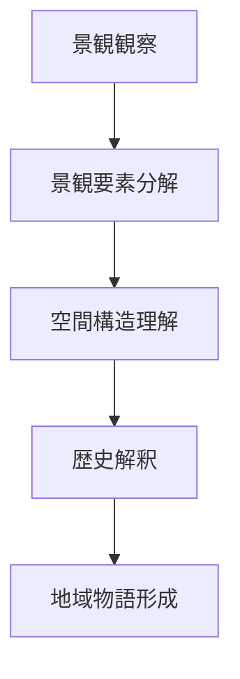
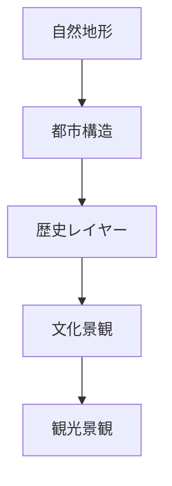

# 景観読解

## 概要

景観読解とは  
**都市や地域の景観から、その背後にある構造・歴史・社会を読み取る行為**である。

景観は単なる視覚的風景ではなく、以下の情報を含む。

- 地形
- 歴史
- 社会構造
- 経済活動
- 文化

したがって景観を読むことは  
**地域構造を理解する最も重要なフィールドワーク技術**である。

---

## 景観読解の基本構造

景観読解は次のプロセスで行う。

---

## 景観の構成要素

景観は複数の要素で構成される。

### 自然要素

- 山
- 河川
- 海岸
- 台地
- 谷

自然要素は都市構造の基盤となる。

例

- 河岸段丘
- 扇状地
- 自然堤防

---

### 空間要素

都市の空間構造。

例

- 街路
- 街区
- 広場
- 建築配置

---

### 建築要素

景観を構成する建築。

例

- 城
- 寺社
- 武家屋敷
- 商家

---

### 人間活動

景観には人間活動が現れる。

例

- 商業活動
- 観光
- 交通
- 生活

---

## 景観レイヤー

景観は複数のレイヤーで構成される。

---

## 景観読解の視点

### 地形視点

都市の立地条件を理解する。

観察例

- 台地
- 河岸段丘
- 扇状地
- 谷

---

### 都市構造視点

都市の空間構造を理解する。

観察例

- 街路構造
- 街区構造
- 都市軸
- 広場

---

### 歴史視点

都市の成立過程を理解する。

観察例

- 城下町
- 宿場町
- 港町
- 門前町

---

### 景観視点

視覚構造を理解する。

観察例

- ランドマーク
- 景観軸
- スカイライン

---

### 観光視点

観光資源を理解する。

観察例

- 観光拠点
- 観光動線
- 景観資源

---

## 景観読解の手順

景観読解は次の順序で行う。

1 地形を理解する  
2 都市構造を理解する  
3 歴史構造を理解する  
4 景観構造を理解する  
5 観光価値を抽出する  

---

## 例

### 金沢

景観観察

- 卯辰山
- 浅野川
- 小立野台地
- 犀川

景観構造

- 河岸段丘都市
- 城下町構造

景観価値

- 武家文化
- 寺町文化
- 城下町景観

---

## 景観読解の目的

景観読解の目的は以下である。

- 地域構造理解
- 歴史理解
- 観光価値発見
- 地域ストーリー形成

---

## 関連ノート

- [[02_zettelkasten/01_knowledge/domain/fieldwork_tourism/01_concept/フィールドワーク観察]]
- [[都市レイヤー]]
- [[景観観察チェックリスト]]
- [[町読みフレーム]]