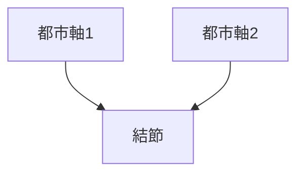

# 結節（都市ノード）

## 概要

結節とは  
**都市の中で人や活動が集中する地点**である。

都市では

- 駅
- 広場
- 交差点
- 観光地

などが結節点となる。

Kevin Lynch の理論では  
**node** と呼ばれる。

---

# 結節の基本構造

結節は  
**都市の線（path）が交わる場所**である。

---

# 結節の種類

## 交通結節

例

- 駅
- バスターミナル

特徴

交通集中。

---

## 都市広場

例

- 駅前広場
- 都市広場

特徴

都市活動。

---

## 商業結節

例

- 繁華街交差点
- 商店街中心

特徴

商業活動。

---

## 観光結節

例

- 観光名所
- 神社入口

特徴

観光集中。

---

# 結節の役割

結節は都市に

- 集中
- 交流
- 活動

を生む。

---

# フィールドワーク質問

1 人はどこに集まるか  
2 交通はどこで交わるか  
3 都市活動の中心はどこか  
4 観光客はどこに集まるか  

---

# 観察ポイント

- 駅前
- 広場
- 大交差点
- 観光地

---

# 例

## 鉄道都市

結節

駅前

特徴

都市中心。

---

## 観光都市

結節

観光地入口

特徴

観光集中。

---

## 商業都市

結節

繁華街交差点

特徴

商業活動。

---

# Kevin Lynch 理論

| Lynch | 空間概念 |
|---|---|
| node | 結節 |

---

# 関連ノート

- [[公共空間観察]]
- [[人流観察]]
- [[都市入口観察]]
- [[都市軸分析]]