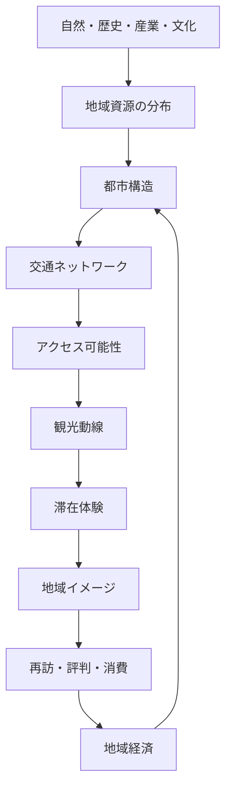

# 鉄道・都市・観光統合型

鉄道・都市・観光統合型とは、鉄道を単なる乗り物や蘊蓄の対象としてではなく、**都市構造・地域構造・観光体験を媒介するシステム**として捉える構造である。

この型では、駅・路線・交通機関は単体で意味を持つのではなく、**人の移動可能性、都市の配置、観光資源の接続、滞在体験の質**の中で理解される。

---

# 位置づけ

この型は、鉄道系コンテンツの以下3型を統合した上位型である。

- [[にっこーけん型]]
- [[スーツ交通型]]
- [[都市・交通システム分析型]]

それぞれが持つ要素を次のように統合する。

| 型 | 主対象 | 強み |
|---|---|---|
| にっこーけん型 | 駅・地域史 | 歴史・地理・蘊蓄 |
| スーツ交通型 | 旅行・体験 | 移動の実況性 |
| 都市・交通システム分析型 | 路線網・都市構造 | 交通政策・需要 |
| 鉄道・都市・観光統合型 | 移動と滞在の全体構造 | 交通・都市・観光を統合 |

---

# 基本発想

交通は観光資源そのものではないが、**観光資源の到達可能性・接続可能性・体験順序**を規定する。

また、

都市構造 → 交通需要 → 交通整備 → 都市拡張 → 観光体験

という循環が存在する。

---

# 全体構造

---

# 構成要素

## 1 地域資源層

地域に存在する資源。

- 景観
- 歴史遺産
- 宗教文化
- 食文化
- 産業遺産
- 祭礼
- 商業集積

関連  
[[観光資源構造]]

---

## 2 都市構造層

資源が都市空間にどう配置されるか。

- 駅前集中型
- 多核都市
- 分散型都市
- 宿場町型
- 城下町型
- 港町型

関連  
[[都市構造]]

---

## 3 交通層

移動手段の構造。

- 鉄道
- バス
- 自動車
- 徒歩
- 自転車
- 船

評価項目

- 本数
- 接続性
- 分かりやすさ
- 乗換回数
- 所要時間

関連  
[[交通ネットワーク構造]]  
[[アクセス構造]]

---

## 4 移動体験層

旅行者が感じる移動の質。

- 迷いやすさ
- 分かりやすさ
- 車窓の魅力
- 乗換の負担
- 移動の楽しさ

関連  
[[移動体験構造]]

---

## 5 滞在体験層

目的地での体験の質。

- 回遊性
- 発見性
- 象徴性
- 滞在密度
- 消費可能性

関連  
[[滞在体験構造]]

---

# 中核命題

## 交通は到達可能性を決める

---

## 都市構造は回遊可能性を決める

---

## 移動自体が観光資源になる場合

例

- 観光列車
- ローカル線
- 山岳鉄道
- 路面電車
- 船旅

関連  
[[移動の観光化]]

---

# 典型パターン

## 駅前集中型観光都市

特徴

- 徒歩回遊可能
- 短時間旅行向き
- 鉄道と相性が良い

---

## 分散型観光地

特徴

- 自動車依存
- 公共交通では回りにくい
- 探索能力で満足度差が出る

---

## 移動自体が主価値

例

- 秘境路線
- 山岳鉄道
- 観光列車

---

## 大都市回遊型

特徴

- 鉄道網理解が体験の質を左右
- 拠点選択が可能
- 回遊型観光

---

# この型で扱える問い

- なぜ同じ資源量でも滞在時間が違うのか  
- なぜ地方都市は駅前が弱いと観光で不利か  
- なぜローカル線が観光資源になる場合があるのか  
- なぜ都市観光では地理感覚が重要なのか  

---

# 要約

鉄道・都市・観光統合型とは、

**交通が都市を形づくり、都市が観光体験を条件づけ、観光体験が地域価値を形成する**

という循環を読む構造である。

鉄道は単なる移動手段ではなく、

**地域を経験可能にするインターフェース**

として理解される。