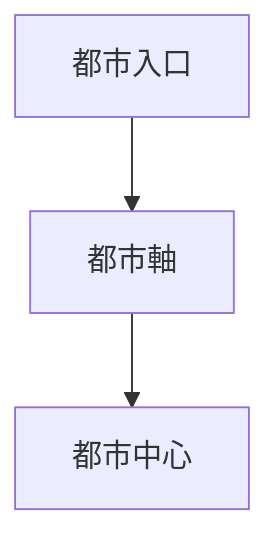

# 線（都市軸）

## 概要

線とは  
**都市空間を移動する経路**である。

都市では

- 道路
- 街路
- 河川
- 鉄道

などが都市の骨格を形成する。

Kevin Lynch の理論では  
**path** と呼ばれる。

---

# 線の基本構造

都市では  
**線が都市の動線を形成する。**

---

# 線の種類

## 街路

例

- 商店街
- メインストリート

特徴

都市活動の中心。

---

## 交通軸

例

- 幹線道路
- 鉄道

特徴

交通動線。

---

## 水路

例

- 河川
- 運河

特徴

物流と景観。

---

## 参道

例

- 神社参道
- 寺院参道

特徴

宗教的導線。

---

# 線の役割

線は都市に

- 移動
- 交流
- 商業

を生む。

---

# フィールドワーク質問

1 都市の主要な道はどこか  
2 人はどこを歩くか  
3 商業はどの道に集中するか  
4 都市はどの方向に伸びているか  

---

# 観察ポイント

- 幹線道路
- 商店街
- 河川沿い
- 鉄道

---

# 例

## 城下町

線

大手道

特徴

城へ向かう。

---

## 鉄道都市

線

駅前通り

特徴

駅中心構造。

---

## 港町

線

港道路

特徴

物流軸。

---

# 分析の目的

線の概念の目的は

- 都市導線理解
- 人流理解
- 都市構造理解

である。

---

# Kevin Lynch 理論

| Lynch | 空間概念 |
|---|---|
| path | 線 |

---

# 関連ノート

- [[都市軸分析]]
- [[人流観察]]
- [[交通観察]]
- [[視線軸観察]]