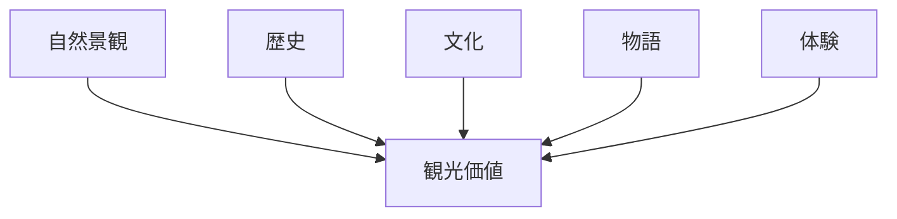
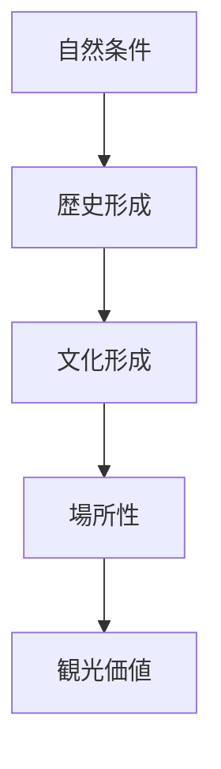
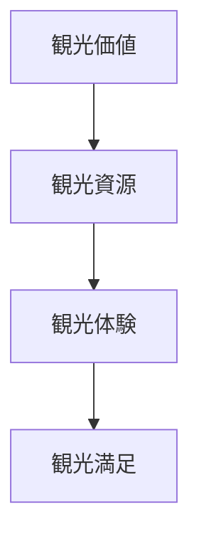

# 観光価値

## 概要

観光価値とは  
**ある場所が観光対象として持つ魅力や意味**を指す概念である。

観光価値は単なる景観の美しさではなく、  
以下の要素の組み合わせによって形成される。

- 自然景観
- 歴史
- 文化
- 物語
- 体験

フィールドワークの目的の一つは  
**観光価値を発見すること**である。

---

## 観光価値の構造

---

## 観光価値の種類

### 自然価値

自然景観による魅力。

例

- 山岳景観
- 海岸景観
- 湖沼
- 渓谷

---

### 歴史価値

歴史的背景による魅力。

例

- 城
- 古戦場
- 遺跡
- 古道

---

### 文化価値

文化や生活による魅力。

例

- 寺社
- 祭礼
- 伝統工芸
- 食文化

---

### 景観価値

視覚的景観の魅力。

例

- 街並み
- 建築
- 景観軸

---

### 体験価値

観光客の体験。

例

- 散策
- 体験活動
- 食事

---

## 観光価値の形成

観光価値は以下のプロセスで形成される。

---

## フィールドワークでの発見方法

観光価値は以下の順序で発見する。

1 地形を理解する  
2 歴史を理解する  
3 文化を理解する  
4 景観を理解する  

これらを統合すると  
観光価値が見えてくる。

---

## 例

### 金沢

自然

- 河岸段丘都市

歴史

- 城下町

文化

- 武家文化
- 茶屋文化
- 工芸文化

景観

- 武家屋敷
- 茶屋街
- 庭園

観光価値

**歴史文化都市観光**

---

### 高山

自然

- 山間盆地

歴史

- 城下町

文化

- 商人文化

景観

- 古い町並み

観光価値

**伝統町並み観光**

---

## 観光価値と観光体験

観光価値は体験として提供される。

---

## 観光価値の目的

この概念の目的は以下である。

- 観光資源を理解する  
- 観光体験を設計する  
- 観光ストーリーを作る  

---

## 関連ノート

- [[場所性]]
- [[都市アイデンティティ]]
- [[観光地分析フレーム]]
- [[観光ストーリー構築フレーム]]