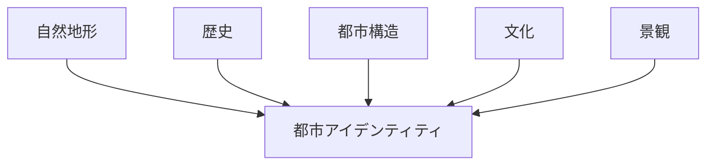
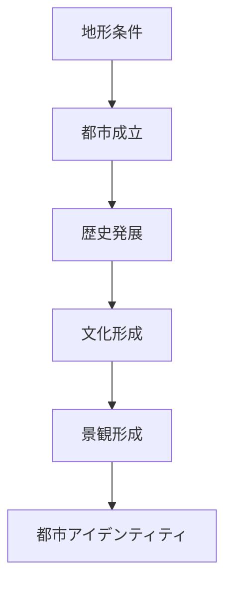
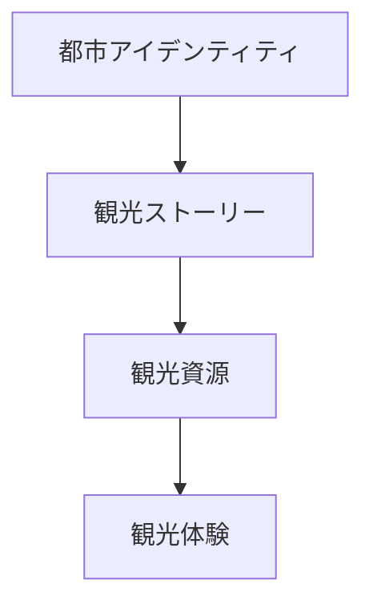

# 都市アイデンティティ

## 概要

都市アイデンティティとは  
**その都市を他の都市と区別する特徴や個性の総体**である。

都市は単なる建築や道路の集合ではなく、  
以下の要素の組み合わせによって独自の性格を持つ。

- 地形
- 歴史
- 文化
- 産業
- 景観

これらが重なって形成されるのが都市アイデンティティである。

---

## 都市アイデンティティの構造

---

## 都市アイデンティティの要素

### 地形

都市の立地条件。

例

- 山
- 河川
- 海岸
- 台地

地形は都市の基本的性格を決める。

---

### 歴史

都市の成立と発展。

例

- 城下町
- 宿場町
- 港町
- 門前町

歴史は都市の文化を形成する。

---

### 都市構造

都市の空間構造。

例

- 街路
- 街区
- 城
- 市場

---

### 文化

地域社会の文化。

例

- 祭礼
- 伝統産業
- 宗教

---

### 景観

都市の視覚的特徴。

例

- ランドマーク
- スカイライン
- 歴史建築

---

## 都市アイデンティティの形成

都市アイデンティティは長い時間の中で形成される。

---

## フィールドワークでの使い方

都市を見るときは次を考える。

1 この都市の地形は何か  
2 この都市は何の都市か  
3 この都市の歴史は何か  
4 この都市の文化は何か  

この4つを理解すると  
都市アイデンティティが見えてくる。

---

## 例

### 金沢

地形

- 河岸段丘
- 山と川に囲まれる

歴史

- 城下町

文化

- 武家文化
- 茶屋文化
- 工芸文化

景観

- 武家屋敷
- 茶屋街
- 庭園

都市アイデンティティ

**武家文化都市**

---

### 奈良

地形

- 奈良盆地

歴史

- 古代都

文化

- 仏教文化

景観

- 寺院
- 古代都市遺構

都市アイデンティティ

**古代宗教都市**

---

## 観光との関係

観光は都市アイデンティティを利用する。

都市の個性が明確であるほど  
観光価値は高くなる。

---

## 都市アイデンティティの目的

この概念の目的は次である。

- 都市の個性を理解する  
- 観光ストーリーを作る  
- 地域ブランドを理解する  

---

## 関連ノート

- [[都市レイヤー]]
- [[景観読解]]
- [[場所性]]
- [[観光地分析フレーム]]