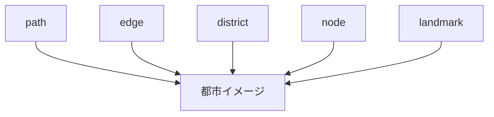

# 都市イメージ要素（Kevin Lynch）

## 概要

都市イメージ要素とは  
都市の空間構造を理解するための基本要素である。

提唱者

Kevin Lynch

著作

The Image of the City

---

# 都市イメージ要素

---

# 要素

- [[path]]
- [[edge]]
- [[district]]
- [[node]]
- [[landmark]]

---

# フィールドワークでの利用

都市観察では

- 道
- 境界
- 地区
- 結節点
- 象徴

を観察することで  
都市構造を理解できる。

---

# 関連ノート

- [[02_zettelkasten/01_knowledge/domain/fieldwork_tourism/04_method/07_observation/05_urban_observation/都市観察チェックリスト]]
- [[都市イメージ分析]]