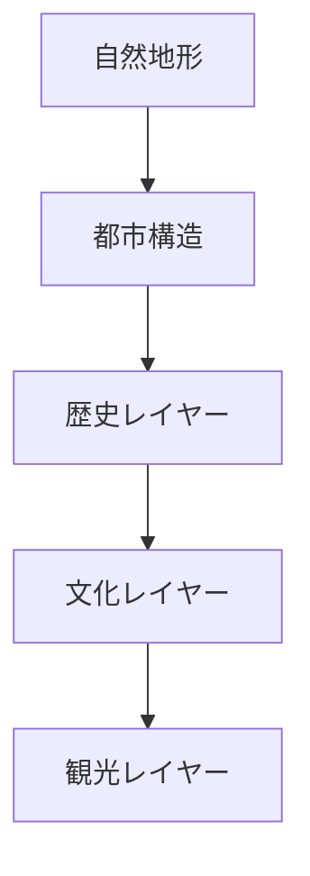
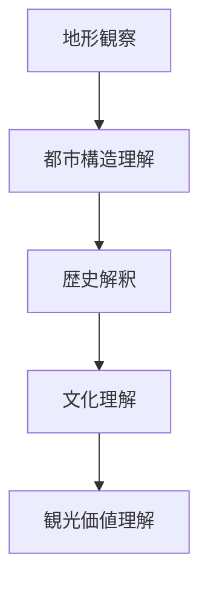

# 都市レイヤー

## 概要

都市レイヤーとは  
**都市を複数の階層（レイヤー）として理解する概念**である。

都市の景観は一つの要素ではなく、  
複数の層が重なって形成されている。

例

- 地形
- 都市構造
- 歴史
- 文化
- 観光

フィールドワークでは  
このレイヤー構造を理解することで

**都市の意味を読み取ることができる。**

---

## 都市レイヤーの基本構造

---

## 第1レイヤー：自然地形

都市の基盤。

例

- 山
- 台地
- 河岸段丘
- 扇状地
- 谷

都市の立地はほぼこのレイヤーで決まる。

---

## 第2レイヤー：都市構造

都市の空間構造。

例

- 城
- 街路
- 街区
- 市場
- 港

都市計画や歴史的都市形成がここに現れる。

---

## 第3レイヤー：歴史

都市の成立過程。

例

- 城下町
- 宿場町
- 港町
- 門前町

このレイヤーは都市構造の意味を説明する。

---

## 第4レイヤー：文化

都市の文化・社会活動。

例

- 寺社
- 商業
- 祭礼
- 職人文化

都市のアイデンティティを形成する。

---

## 第5レイヤー：観光

現代における都市の利用。

例

- 観光ルート
- 観光拠点
- 景観資源

観光地としての意味はこのレイヤーで現れる。

---

## 都市レイヤーの理解プロセス

---

## フィールドワークでの使い方

都市を見るときは  
以下の順序で考える。

1 地形を見る  
2 都市構造を見る  
3 歴史を見る  
4 文化を見る  
5 観光価値を見る  

---

## 例

### 金沢

自然地形

- 卯辰山
- 小立野台地
- 浅野川
- 犀川

都市構造

- 城
- 武家地
- 寺町
- 町人地

歴史

- 城下町

文化

- 武家文化
- 寺院文化

観光

- 兼六園
- 長町武家屋敷
- 東茶屋街

---

## 都市レイヤーの目的

都市レイヤー概念は次の能力を作る。

- 都市の構造理解
- 歴史理解
- 文化理解
- 観光価値発見

---

## 関連ノート

- [[02_zettelkasten/01_knowledge/domain/fieldwork_tourism/01_concept/フィールドワーク観察]]
- [[景観読解]]
- [[地形解釈]]
- [[町読みフレーム]]