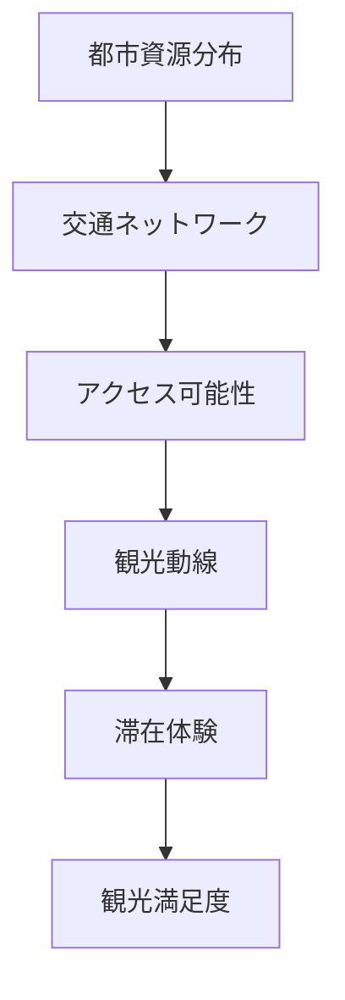
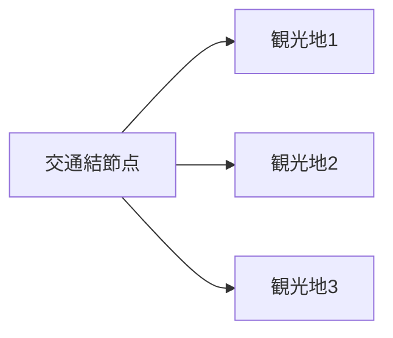

# 都市交通システム分析型観光

都市交通システム分析型観光とは、都市観光を**観光資源の魅力だけではなく、都市交通ネットワークの構造から分析する方法**である。

この方法では、観光体験は

**都市構造 × 交通ネットワーク × 移動行動**

の相互作用によって形成されると考える。

---

# 基本命題

都市観光の実体は

**観光地ではなく「移動可能性の構造」である**

つまり観光体験は

- どこに資源があるか
- そこへどう到達するか
- どの順序で回れるか

によって決まる。

---

# 基本構造



---

# 構成要素

## 1 都市資源分布

都市に存在する観光資源。

例

- 歴史地区
- 商業地区
- 美術館
- 寺社
- 景観
- 公園
- 飲食街

評価視点

- 密度
- 集中度
- 分散度
- 歩行距離

---

## 2 交通ネットワーク

都市内移動のインフラ。

主な交通

- 地下鉄
- 都市鉄道
- 路面電車
- バス
- 徒歩
- 自転車
- タクシー

評価視点

- 本数
- 接続性
- 網密度
- 分かりやすさ

---

## 3 アクセス可能性

観光地へ到達する難易度。

評価要素

- 所要時間
- 乗換回数
- 歩行距離
- 運賃
- 情報理解容易性

アクセス可能性は


で決定される。

---

## 4 観光動線

旅行者が実際に移動する経路。

典型パターン

- ハブ型
- 直線型
- 回遊型
- 放射型



---

## 5 滞在体験

移動と観光資源の組み合わせによって生まれる体験。

主な評価

- 回遊しやすさ
- 発見性
- 滞在密度
- 歩行快適性
- 移動ストレス

---

# 都市観光の4類型

## 1 駅前集中型

特徴

- 観光地が駅周辺に集中
- 徒歩回遊可能

例

- 京都
- 金沢

---

## 2 都市鉄道回遊型

特徴

- 地下鉄網を使って回遊

例

- 東京
- パリ

---

## 3 分散型都市

特徴

- 観光地が広域に分散
- バスや自動車が重要

例

- ロサンゼルス

---

## 4 コンパクト都市

特徴

- 徒歩中心
- 観光資源密度が高い

例

- フィレンツェ
- 奈良

---

# 都市観光体験の決定式

都市観光体験は次の要素で決まる。

```
観光体験 = 観光資源 × アクセス可能性 × 回遊性
```

どれかが低いと満足度が下がる。

---

# 分析テンプレート

都市観光を分析する際の基本質問。

## 都市構造

- 観光資源は集中か分散か
- 中心地はどこか

## 交通

- 鉄道網は密か
- バスは補完しているか

## 動線

- 初見旅行者は迷うか
- 乗換は多いか

## 滞在

- 徒歩回遊できるか
- 滞在時間は長いか

---

# この方法の利点

1. 観光地の魅力を構造的に説明できる  
2. 都市比較が可能  
3. 観光政策や交通政策と接続できる  

---

# 関連ノート

- [[鉄道・都市・観光統合型]]
- [[交通ネットワーク構造]]
- [[都市構造]]
- [[観光動線構造]]
- [[移動体験構造]]
- [[滞在体験構造]]

---

# 要約

都市交通システム分析型観光とは、

**都市観光を交通ネットワークと都市構造の相互作用として理解する分析方法である。**

この方法では観光は

**観光地ではなく「移動可能性の設計」**

として理解される。