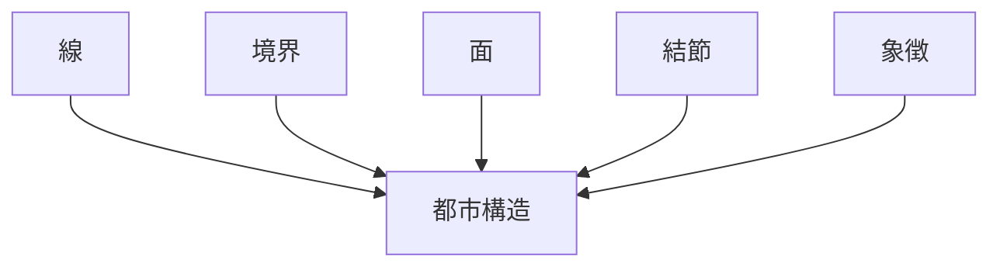

# 都市空間要素

## 概要

都市空間は以下の要素で構成される。

- 線
- 境界
- 面
- 結節
- 象徴

この構造は  
Kevin Lynch の都市イメージ理論と対応する。

---

# 都市空間要素

---

# 要素

- [[線（都市軸）]]
- [[境界（都市エッジ）]]
- [[面（都市地区）]]
- [[結節（都市ノード）]]
- [[象徴（ランドマーク）]]

---

# Kevin Lynchとの対応

| Lynch | 空間分類 |
|---|---|
| path | 線 |
| edge | 境界 |
| district | 面 |
| node | 結節 |
| landmark | 象徴 |

---

# フィールドワークでの使い方

都市観察では以下を確認する。

1 都市の線
2 都市の境界
3 都市の面
4 都市の結節
5 都市の象徴

これらの組み合わせが都市構造を作る。