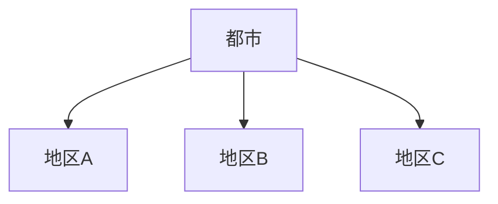

# 面（都市地区）

## 概要

面とは  
**都市の中で同じ性格を持つ空間領域**である。

都市では

- 商業地区
- 住宅地区
- 観光地区
- 工業地区

などの地区が形成される。

Kevin Lynch の理論では  
**district** と呼ばれる。

---

# 面の基本構造

都市は  
**複数の地区の集合**で構成される。

---

# 面の種類

## 商業地区

例

- 商店街
- 繁華街

特徴

店舗集中。

---

## 住宅地区

例

- 住宅街
- 郊外住宅

特徴

生活空間。

---

## 観光地区

例

- 観光地
- 歴史地区

特徴

観光活動。

---

## 工業地区

例

- 工業地帯