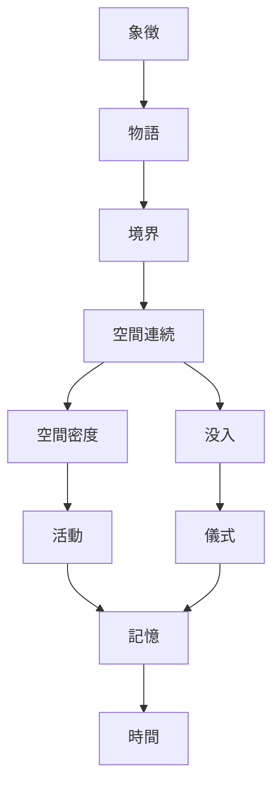

# 評価方法
観光満足度=空間体験+意味体験+記憶体験
[[観光体験満足度採点方法]]
# 軸
## 空間体験（Physical Experience）
- A [[没入性]]
- B [[連続性]]
- C [[活動性]]
- D [[空間密度]]
- G [[境界性]]
## 意味体験（Meaning Experience）
- E [[物語可視性]]
- H [[象徴性]]
- J [[時間層]]
## 行動体験（Behavior Experience）
- F [[儀式性]]
## 記憶体験（Memory Experience）
- I [[記憶装置]]
# 構造

## 観光評価への影響
| 軸    | 記憶  | 共有  | 再訪  | 理解  | 没入  | 満足  | 探索  | 滞在  | 体験  | 動機  |
| ---- | --- | --- | --- | --- | --- | --- | --- | --- | --- | --- |
| 象徴性  | 〇   | 〇   | △   |     |     | △   |     |     |     | 〇   |
| 物語性  | 〇   |     | △   | 〇   | 〇   | 〇   |     |     |     | △   |
| 境界性  |     |     |     |     | 〇   | 〇   | 〇   |     |     |     |
| 連続性  |     |     |     |     | 〇   | 〇   | 〇   | 〇   |     |     |
| 空間密度 |     |     |     |     |     | 〇   | 〇   | 〇   |     |     |
| 没入性  | 〇   |     |     |     | 〇   | 〇   |     |     |     |     |
| 活動性  | 〇   | △   | △   |     |     | 〇   |     | 〇   | 〇   |     |
| 儀式性  | 〇   | 〇   | 〇   |     |     | △   |     |     | 〇   |     |
| 記憶装置 | 〇   | 〇   | △   |     |     |     |     |     | 〇   |     |
| 時間層  | 〇   |     |     | 〇   | △   | 〇   |     |     | 〇   |     |
〇：強い効果　△：間接効果　空欄：なし