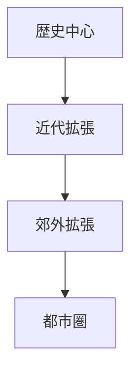
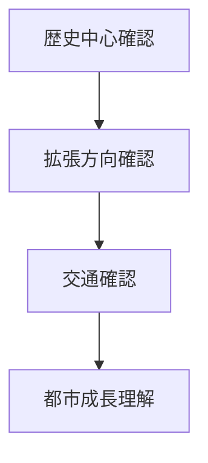

# 都市成長分析

## 概要

都市成長分析とは  
**都市がどのように拡張してきたかを分析する方法**である。

都市は

- 歴史
- 交通
- 経済

によって拡張する。

都市成長を分析することで

- 都市形成
- 都市構造
- 都市問題

を理解できる。

---

# 都市成長の基本構造

---

# 都市成長タイプ

## 同心円型

特徴

- 中心から拡張

例

- 多くの都市

---

## 放射型

特徴

- 交通沿い

例

- 鉄道都市

---

## 多中心型

特徴

- 副中心形成

例

- 大都市圏

---

# 分析手順

---

# フィールドワーク質問

1 最も古い都市中心はどこか  
2 都市はどの方向に拡張したか  
3 交通はどこに通ったか  

---

# 目的

- 都市形成理解  
- 都市発展理解  

---

# 関連ノート

- [[土地利用分析]]
- [[都市境界分析]]