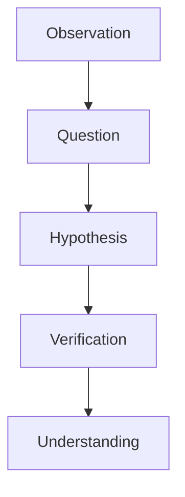
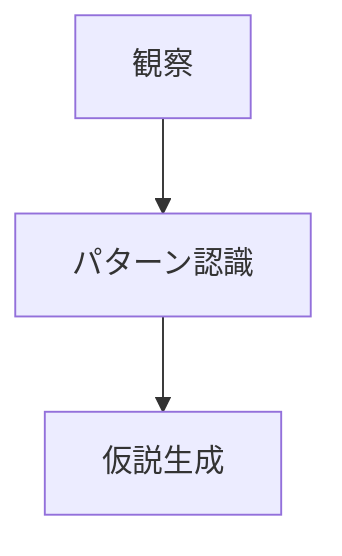
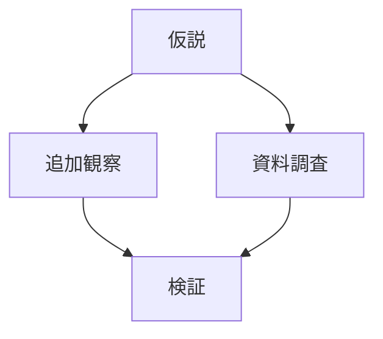
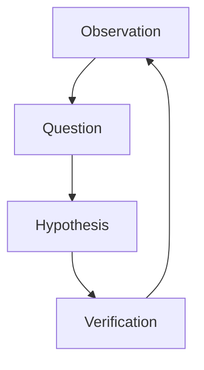

# Fieldwork Hypothesis Engine（フィールドワーク仮説エンジン）

## 概要

Fieldwork Hypothesis Engineとは  
**フィールドワークにおいて観察から仮説を生成し、検証する思考フレームである。**

フィールドワークでは

観察 → 問い → 仮説 → 検証 → 理解

という研究プロセスが繰り返される。

---

# フィールドワーク研究構造

---

# 仮説の種類

## 構造仮説

空間構造に関する仮説。

例

- この街は街道都市ではないか  
- この集落は港町ではないか  

---

## 形成仮説

歴史形成に関する仮説。

例

- この町は宿場町として発展したのではないか  
- この地区は城下町の武家地ではないか  

---

## 機能仮説

地域機能に関する仮説。

例

- この地域は農業中心ではないか  
- この都市は交通拠点ではないか  

---

## 観光仮説

観光資源に関する仮説。

例

- この景観は観光資源になるのではないか  
- この町並みは観光地区ではないか  

---

# 仮説生成フレーム

---

# 仮説検証フレーム

---

# フィールドワーク質問

仮説検証では次を問う。

- この仮説を支持する証拠は何か  
- この仮説に反する証拠は何か  
- 他の説明は可能か  

---

# 仮説例

## 城下町仮説

観察

城跡がある。

仮説

この都市は城下町である。

検証

- 武家屋敷があるか  
- 城下町構造があるか  

---

## 宿場町仮説

観察

街道沿いの町並み。

仮説

この町は宿場町である。

検証

- 本陣跡  
- 宿場構造  

---

# フィールドワーク研究サイクル

---

# フィールドワークの成果

仮説検証によって

- 地域構造理解
- 地域形成理解
- 地域特性理解

が深まる。

---

# 関連ノート

- [[Fieldwork Question Engine]]
- [[Fieldwork Execution Hub]]
- [[Regional Structure Hub]]
- [[Regional Formation Hub]]
- [[Regional Comparison Hub]]