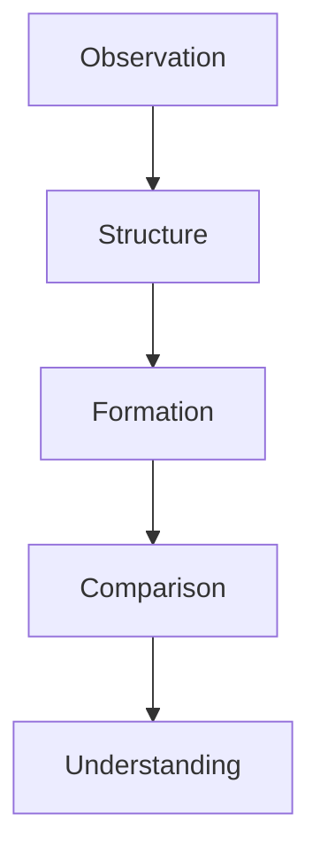
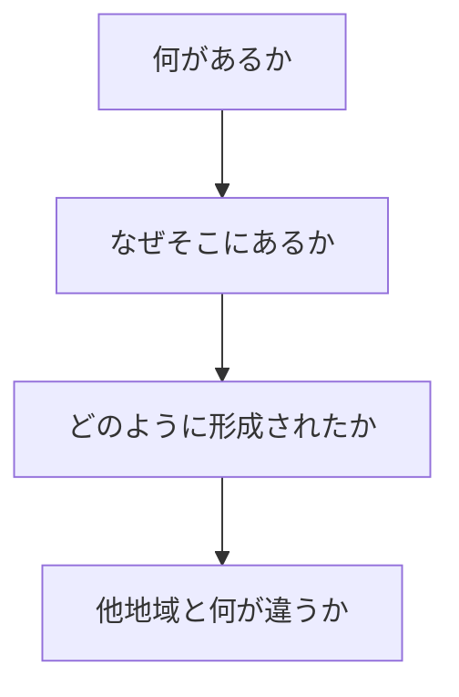
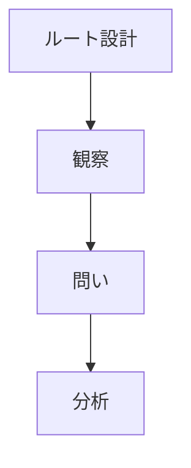

# Fieldwork Question Engine（フィールドワーク問いエンジン）

## 概要

Fieldwork Question Engineとは  
**フィールドワークにおいて地域理解を進めるための問いの体系**である。

フィールドワークでは

観察 → 構造理解 → 形成理解 → 比較

というプロセスを  
問いによって進める。

---

# フィールドワーク思考構造

---

# 問いのレベル

## Level 1 観察問い

現象を確認する問い。

例

- 何があるか
- どこにあるか
- どのように見えるか

---

## Level 2 構造問い

構造を理解する問い。

例

- なぜそこにあるか
- 何と関係しているか
- どの要素が結びついているか

---

## Level 3 形成問い

歴史・形成を理解する問い。

例

- いつ形成されたか
- どのように発展したか
- 何がきっかけだったか

---

## Level 4 比較問い

地域特性を理解する問い。

例

- 他地域と何が違うか
- 共通パターンは何か
- この地域の特徴は何か

---

# フィールドワーク質問フレーム

---

# 基本質問

## 空間

- どこにあるか  
- どのように配置されているか  

---

## 関係

- 何と関係しているか  
- どの要素が影響しているか  

---

## 時間

- いつ形成されたか  
- どのように発展したか  

---

## 特性

- 他地域と何が違うか  
- この地域の特徴は何か  

---

# フィールドワーク実行

---

# 例

## 城下町

観察

城がある

問い

なぜここに城があるのか

形成

政治中心

比較

他の城下町と何が違うか

---

# フィールドワークの目的

問いを通して

- 地域構造
- 地域形成
- 地域特性

を理解する。

---

# 関連ノート

- [[Fieldwork Execution Hub]]
- [[Fieldwork Route Design]]
- [[Regional Structure Hub]]
- [[Regional Formation Hub]]
- [[Regional Comparison Hub]]