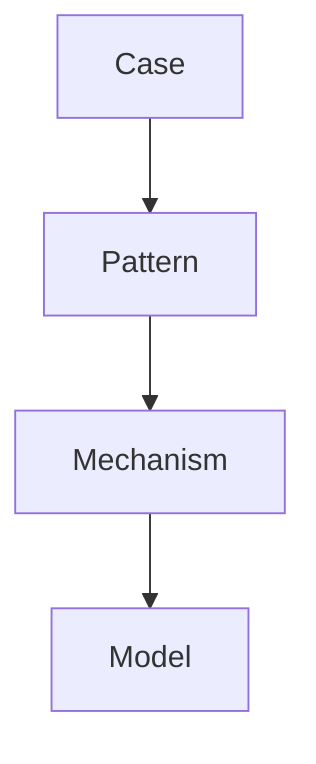
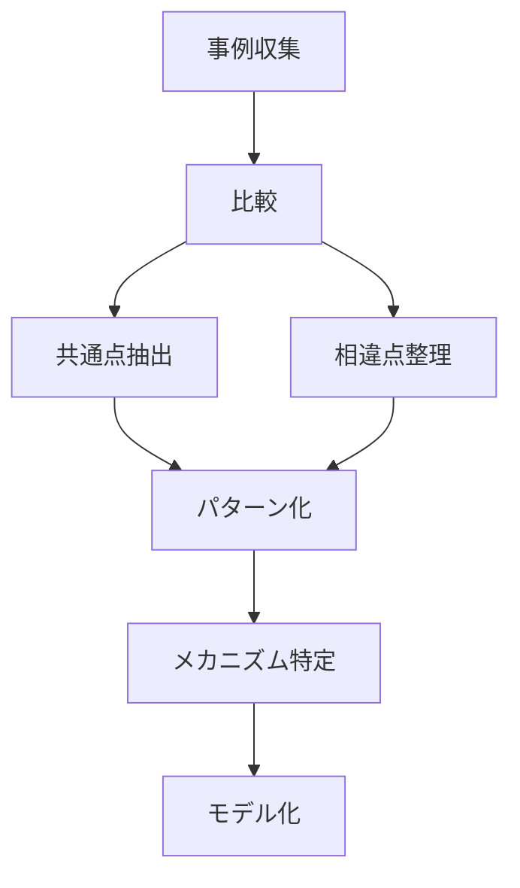
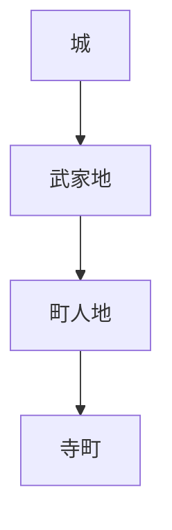
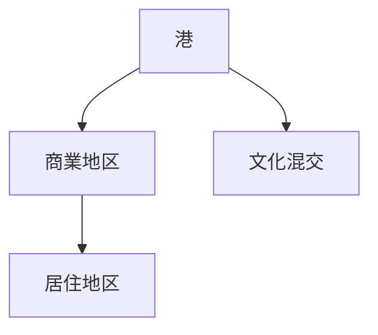
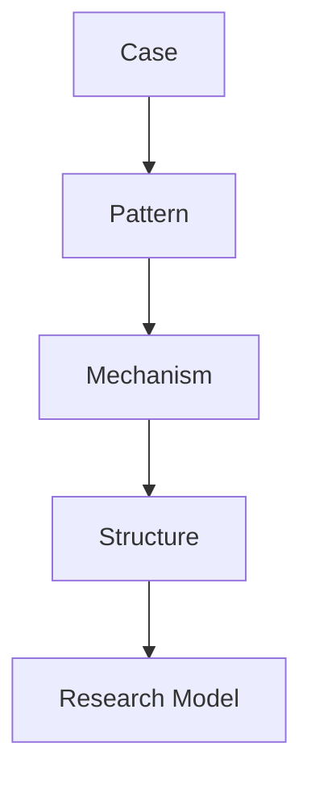

# Model Extraction Engine（モデル抽出エンジン）

## 概要

Model Extraction Engineとは  
**個別事例からパターンを抽出し、一般モデルへ昇華するための思考フレーム**である。

研究では  
事例を集めるだけでは不十分である。

必要なのは

- 共通点の抽出
- 相違点の整理
- 構造の把握
- 一般化

である。

このエンジンは

事例 → パターン → メカニズム → モデル

という流れを整理する。

---

# 基本構造

---

# 各段階の意味

## Case

個別事例。

例

- 金沢
- 松本
- 長崎
- 妻籠

ここでは  
まず事例を具体的に記述する。

---

## Pattern

複数事例に見られる共通構造。

例

- 城を中心に都市が形成される
- 港を中心に商業地区が形成される
- 街道沿いに宿場町が形成される

Patternは  
**反復して現れる形**である。

---

## Mechanism

なぜそのパターンが生じるのか。

例

- 防御性
- 物流効率
- 交通結節
- 政治統制

Mechanismは  
**因果的説明**である。

---

## Model

複数のパターンとメカニズムを統合した一般モデル。

例

- 城下町形成モデル
- 港町形成モデル
- 宿場町形成モデル

Modelは  
**事例を超えて使える説明装置**である。

---

# 抽出プロセス

---

# モデル抽出の質問

## Case段階

- この事例の特徴は何か  
- どの要素が重要か  
- 何が観察できるか  

---

## Pattern段階

- 他の事例にも繰り返し見られるか  
- どの要素が共通するか  
- どの順序で現れるか  

---

## Mechanism段階

- なぜこのパターンが生じるのか  
- 背後にある制約や誘因は何か  
- 他の説明可能性はあるか  

---

## Model段階

- どこまで一般化できるか  
- どの条件下で成立するか  
- 例外は何か  

---

# 抽出テンプレート

## 1 Case

事例名  
特徴  
観察事項  

---

## 2 Pattern

共通構造  
繰り返し現れる要素  
他事例との対応  

---

## 3 Mechanism

発生理由  
因果関係  
制約条件  

---

## 4 Model

モデル名  
適用範囲  
構造図  
例外条件  

---

# 例1 城下町モデル

## Case

- 金沢
- 松本
- 姫路

## Pattern

- 城が高所にある
- 武家地が近接する
- 町人地が外側に形成される
- 寺町が周縁に配置される

## Mechanism

- 防御
- 政治統制
- 身分秩序
- 城郭中心行政

## Model

城下町形成モデル

---

# 例2 港町モデル

## Case

- 長崎
- 神戸
- 函館

## Pattern

- 港を中心に商業が発達
- 背後に居住地区
- 外来文化が流入

## Mechanism

- 海上交通
- 物流集中
- 対外交流

## Model

港町形成モデル

---

# モデル抽出の注意

## 1 事例を急いでモデル化しない

少数事例だけで一般化しすぎない。

---

## 2 パターンとメカニズムを混同しない

Pattern は  
「何が繰り返されるか」

Mechanism は  
「なぜそうなるか」

である。

---

## 3 例外条件を明示する

どの条件でモデルが成立しないかを確認する。

---

# Vault内での位置

Model Extraction Engine は  
この変換の中心にある。

---

# このノートの役割

このノートは

- 事例を理論化する
- Pattern層とModel層を接続する
- Vault全体の抽象化能力を上げる

ためのエンジンである。

---

# 関連ノート

- [[Research Model Layer]]
- [[Fieldwork Hypothesis Engine]]
- [[Regional Comparison Hub]]
- [[Pattern Extraction Method 1]]
- [[Mechanism Identification]]