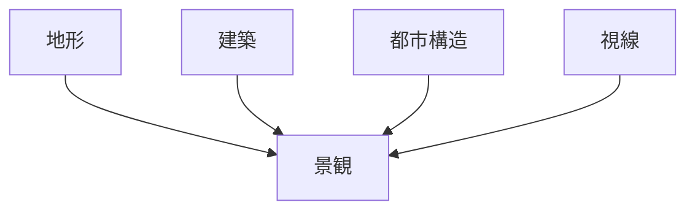
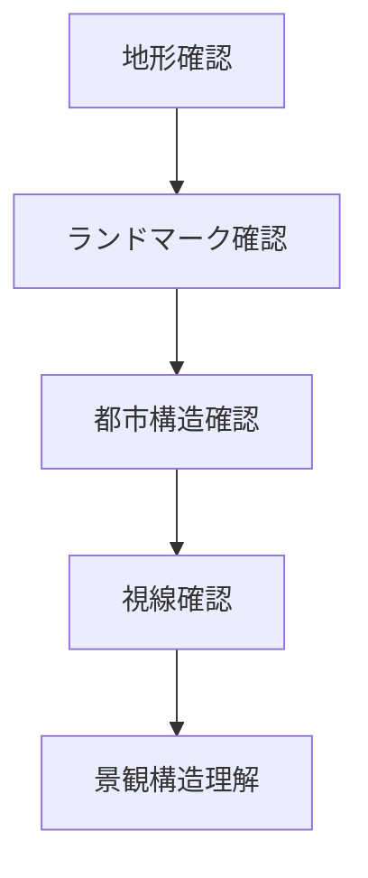

# 景観分析フレーム

## 概要

景観分析フレームとは  
**都市や地域の景観構造を体系的に分析する方法**である。

景観は

- 地形
- 建築
- 都市構造
- 視線

の組み合わせで形成される。

このフレームを使うことで

- 景観構造
- 観光景観
- 都市象徴

を理解できる。

---

# 景観の基本構造

---

# 景観分析の4要素

## 地形

地形は景観の基盤である。

観察対象

- 山
- 河川
- 段丘
- 海岸

関連ノート

- [[地形解釈]]
- [[河川分析]]
- [[都市高低差分析]]

---

## 建築

建築は景観の主要要素である。

観察対象

- 寺社
- 城
- 高層建築
- 町家

---

## 都市構造

都市構造は景観の配置を決める。

観察対象

- 街路
- 街区
- 都市軸

関連ノート

- [[都市軸分析]]
- [[街区分析]]

---

## 視線

視線は景観体験を決める。

観察対象

- 視界の抜け
- 景観焦点
- 遠景

関連ノート

- [[ランドマーク分析]]

---

# 景観分析の手順

---

# フィールドワーク質問

1 景観の背景は何か  
2 景観の焦点は何か  
3 視界はどこに抜けるか  
4 建築はどのように配置されているか  

---

# 景観タイプ

## 山岳景観

例

- 京都東山
- 長崎

---

## 河岸景観

例

- 鴨川
- 隅田川

---

## 都市景観

例

- 東京
- 大阪

---

## 歴史景観

例

- 城下町
- 宿場町

---

# 分析の目的

景観分析の目的は以下である。

- 景観構造理解  
- 観光資源理解  
- 都市象徴理解  

---

# 関連ノート

- [[ランドマーク分析]]
- [[都市軸分析]]
- [[河川分析]]
- [[都市高低差分析]]
- [[景観観察チェックリスト]]