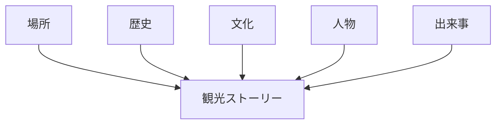
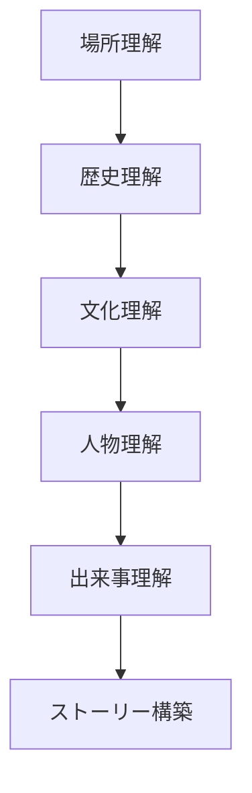
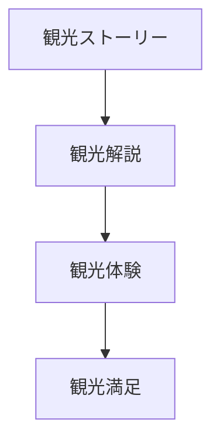

# 観光ストーリー構築フレーム

## 概要

観光ストーリー構築フレームとは  
**観光地の意味や魅力を物語として構築するためのフレームワーク**である。

観光地は単なる場所ではなく、

- 歴史
- 文化
- 人物
- 出来事

によって意味づけられる。

この意味を整理し、物語として提示することで  
観光体験は大きく深まる。

---

## 観光ストーリーの基本構造

---

## ストーリーの要素

### 場所

ストーリーの舞台。

例

- 城
- 寺社
- 街並み

場所はストーリーの背景となる。

---

### 歴史

過去の出来事。

例

- 城下町成立
- 戦い
- 政治

歴史はストーリーの時間軸を作る。

---

### 文化

地域文化。

例

- 祭り
- 伝統工芸
- 食文化

文化はストーリーに深みを与える。

---

### 人物

歴史人物や地域人物。

例

- 武将
- 商人
- 職人

人物はストーリーを具体化する。

---

### 出来事

重要な事件や出来事。

例

- 合戦
- 政治事件
- 災害

出来事はストーリーの展開を作る。

---

## ストーリー構築のプロセス

---

## フィールドワークでの質問

観光地を見るときは次を考える。

1 この場所は何か  
2 この場所で何が起こったか  
3 誰が関係したか  
4 どんな文化があるか  

これらを組み合わせると  
観光ストーリーができる。

---

## 例

### 金沢

場所

- 金沢城
- 武家屋敷

歴史

- 加賀藩

文化

- 武家文化
- 茶屋文化

人物

- 前田利家

ストーリー

**加賀百万石の城下町**

---

### 京都

場所

- 寺院
- 古都

歴史

- 千年の都

文化

- 宮廷文化
- 仏教文化

ストーリー

**日本文化の中心**

---

## ストーリーと観光体験

ストーリーがあると  
観光体験は深くなる。

---

## 観光ストーリー構築の目的

このフレームの目的は以下である。

- 観光地の意味を説明する  
- 観光体験を深める  
- 観光コンテンツを作る  

---

## 関連ノート

- [[観光価値]]
- [[都市アイデンティティ]]
- [[場所性]]
- [[観光動線設計フレーム]]