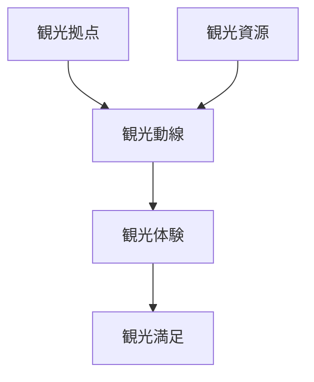
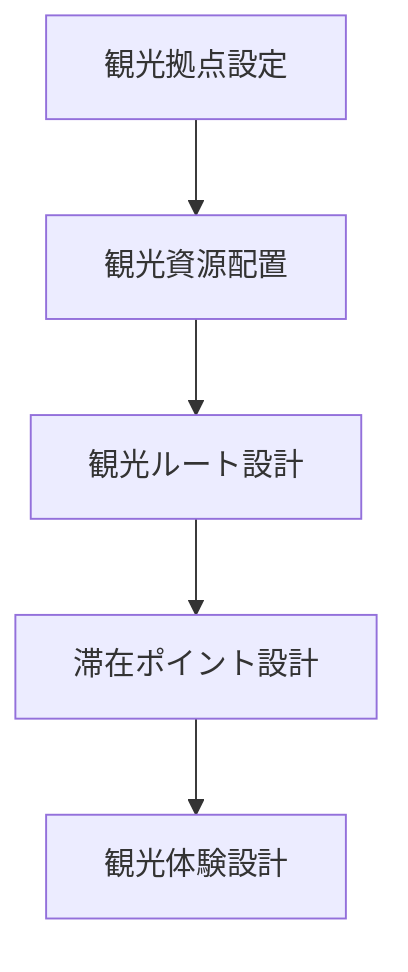
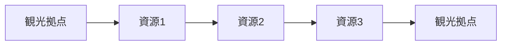
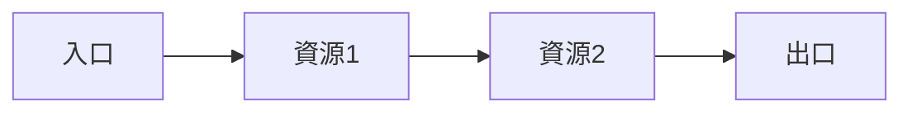

# 観光動線設計フレーム

## 概要

観光動線設計フレームとは  
**観光客が観光地をどのように移動し体験するかを設計するためのフレームワーク**である。

観光地は単に資源が存在するだけでは成立しない。

観光客は

- どこから来て
- どこに行き
- どの順序で見るか

によって体験が大きく変わる。

観光動線は観光体験の骨格である。

---

## 観光動線の基本構造

---

## 観光動線の要素

### 観光拠点

観光客の起点。

例

- 駅
- 駐車場
- 観光案内所

ここから観光動線が始まる。

---

### 観光資源

動線上の観光対象。

例

- 景観
- 建築
- 文化施設

観光資源は動線上に配置される。

---

### 観光ルート

観光客の移動ルート。

例

- 散策ルート
- 周遊ルート
- 回遊ルート

---

### 滞在ポイント

観光客が滞在する場所。

例

- 広場
- カフェ
- 展望地点

滞在ポイントは観光体験を深める。

---

## 観光動線設計のプロセス

---

## フィールドワークでの質問

観光地を見るときは次を考える。

1 観光客はどこから来るか  
2 最初に何を見るか  
3 次にどこへ行くか  
4 どこで滞在するか  
5 最後に何を見るか  

---

## 典型的な観光動線

### 回遊型

---

### 直線型

---

## 例

### 金沢

観光拠点

- 金沢駅

観光動線

駅  
↓  
近江町市場  
↓  
金沢城  
↓  
兼六園  
↓  
東茶屋街

観光体験

- 食文化
- 歴史景観
- 街歩き

---

## 観光動線設計の目的

このフレームの目的は以下である。

- 観光体験向上  
- 観光地回遊促進  
- 観光資源活用  

---

## 関連ノート

- [[観光地分析フレーム]]
- [[観光資源評価フレーム]]
- [[観光価値]]
- [[観光ストーリー構築フレーム]]