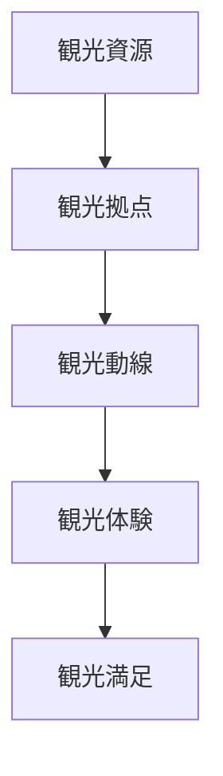
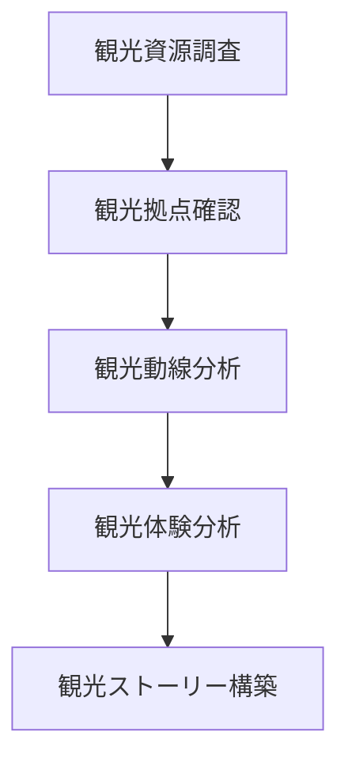

# 観光地分析フレーム

## 概要

観光地分析フレームとは  
**ある場所が観光地として成立する条件と構造を分析するためのフレームワーク**である。

観光地は単に名所が存在するだけでは成立しない。

観光地には以下の要素が必要である。

- 観光資源
- 観光体験
- 観光動線
- 観光拠点
- 観光ストーリー

これらを体系的に理解するためのフレームが  
観光地分析フレームである。

---

## 観光地の基本構造

---

## 観光資源

観光の対象となる要素。

例

- 自然景観
- 歴史建築
- 文化施設
- 街並み

観光資源は観光地の基盤である。

---

## 観光拠点

観光客が集まる場所。

例

- 駅
- 観光案内所
- 駐車場
- 広場

観光拠点は観光動線の起点となる。

---

## 観光動線

観光客が移動するルート。

例

- 散策ルート
- 観光回遊
- 歩行者動線

観光動線は観光体験を構成する。

---

## 観光体験

観光客が得る体験。

例

- 景観鑑賞
- 文化体験
- 食事
- 散策

体験が観光満足を生む。

---

## 観光ストーリー

観光地の意味を説明する物語。

例

- 歴史
- 文化
- 人物

ストーリーは観光価値を強化する。

---

## 観光地分析のプロセス

---

## フィールドワークでの質問

観光地を見るときは次を考える。

1 何が観光資源か  
2 観光客はどこから来るか  
3 観光客はどこを歩くか  
4 観光客は何を体験するか  
5 観光地のストーリーは何か  

---

## 例

### 金沢

観光資源

- 兼六園
- 金沢城
- 武家屋敷
- 茶屋街

観光拠点

- 金沢駅

観光動線

- 駅
- 近江町市場
- 城
- 兼六園
- 東茶屋街

観光体験

- 歴史景観
- 食文化
- 散策

観光ストーリー

**加賀百万石の城下町**

---

## 観光地分析の目的

観光地分析の目的は以下である。

- 観光構造理解  
- 観光資源発見  
- 観光体験設計  
- 観光地改善  

---

## 関連ノート

- [[町読みフレーム]]
- [[観光価値]]
- [[都市アイデンティティ]]
- [[観光資源評価フレーム]]