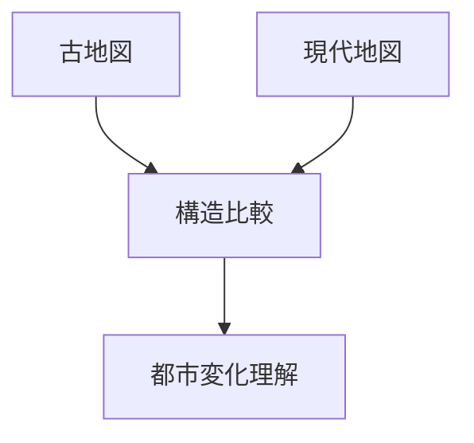
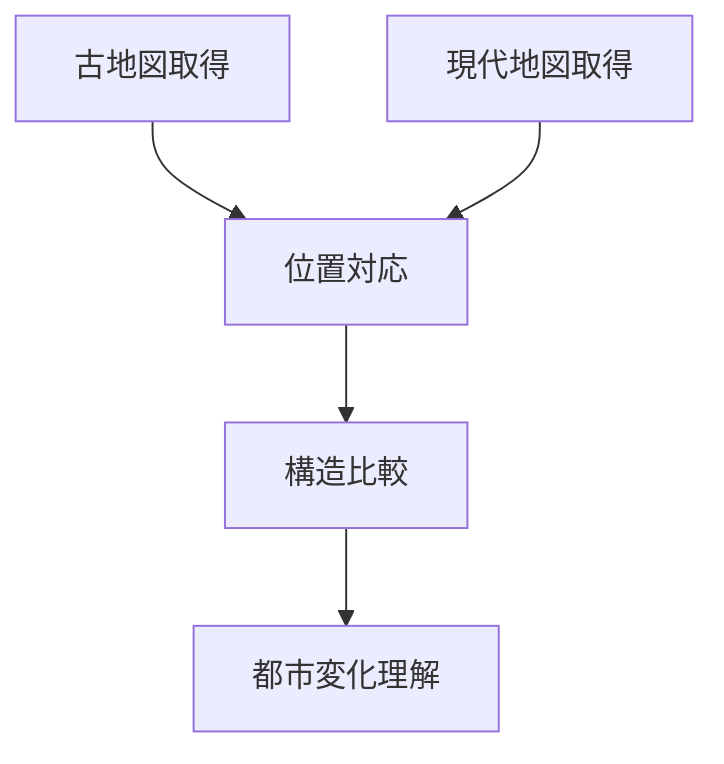

# 古地図比較

## 概要

古地図比較とは  
**古地図と現在の地図を比較して都市構造の変化を分析する方法**である。

この方法により

- 都市形成
- 都市拡張
- 土地利用変化

を理解できる。

---

# 古地図比較の基本構造

---

# 比較対象

## 街路

確認すること

- 街路方向
- 街路密度

観察ポイント

古い街路が残る場所は

歴史地区

である可能性が高い。

---

## 河川

確認すること

- 河川位置
- 河川改修

観察ポイント

多くの都市では

河川 → 都市形成

となる。

---

## 土地利用

確認すること

- 城
- 寺社
- 武家地
- 町人地

観察ポイント

旧用途は現在の都市構造に影響する。

---

## 都市境界

確認すること

- 城郭
- 外堀
- 城下町境界

観察ポイント

都市の成長方向がわかる。

---

# 古地図比較の手順

---

# フィールドワーク質問

1 古い街路はどこに残っているか  
2 河川は変わっているか  
3 古い土地利用は何か  
4 都市はどの方向に拡張したか  

---

# 例

### 京都

古地図

平安京

特徴

- 碁盤目

現代

- 街路が残存

---

### 金沢

古地図

城下町

特徴

- 武家地
- 町人地

現代

- 長町武家屋敷

---

### 東京

古地図

江戸

特徴

- 外堀

現代

- 地形に痕跡

---

# 分析の目的

古地図比較の目的は以下である。

- 都市形成理解  
- 都市変化理解  
- 歴史景観理解  

---

# 関連ノート

- [[土地利用分析]]
- [[河川分析]]
- [[都市成長分析]]
- [[街区分析]]