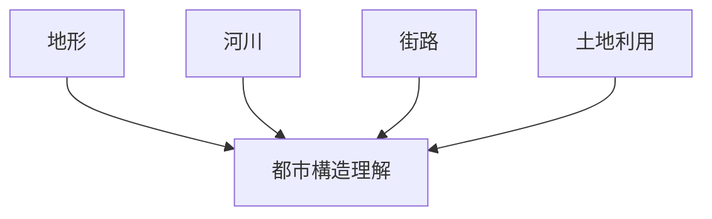
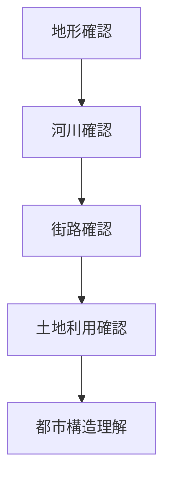

# 地図読解法

## 概要

地図読解法とは  
**地図から都市や地域の構造を読み取る方法**である。

地図には

- 地形
- 河川
- 街路
- 土地利用

などの情報が含まれている。

これらを読み解くことで

- 都市形成
- 空間構造
- 観光資源

を理解できる。

---

# 地図読解の基本構造

---

# 地図読解の主要要素

## 地形

最初に地形を見る。

確認すること

- 山
- 段丘
- 谷
- 海岸

観察ポイント

地形は都市立地を決める。

関連ノート

- [[地形解釈]]

---

## 河川

次に河川を見る。

確認すること

- 河川位置
- 河川方向
- 河川合流

観察ポイント

多くの都市は

河川沿い

に成立する。

関連ノート

- [[河川分析]]

---

## 街路

街路構造を見る。

確認すること

- 街路方向
- 街路密度
- 直線道路

観察ポイント

街路は都市計画を反映する。

関連ノート

- [[都市軸分析]]
- [[街区分析]]

---

## 土地利用

土地利用を見る。

確認すること

- 住宅
- 商業
- 公共施設

観察ポイント

都市機能が分かる。

関連ノート

- [[土地利用分析]]

---

# 地図読解の手順

---

# フィールドワーク質問

1 都市はどこに立地しているか  
2 河川は都市にどう影響しているか  
3 街路構造はどうなっているか  
4 都市の中心はどこか  

---

# 例

### 京都

地形

盆地

河川

鴨川

街路

碁盤目

---

### 金沢

地形

河岸段丘

河川

浅野川  
犀川

街路

城下町街路

---

### 東京

地形

台地と低地

河川

隅田川

街路

放射環状

---

# 分析の目的

地図読解法の目的は以下である。

- 都市構造理解  
- フィールドワーク準備  
- 観光資源理解  

---

# 関連ノート

- [[古地図比較]]
- [[土地利用分析]]
- [[河川分析]]
- [[都市軸分析]]
- [[景観分析フレーム]]