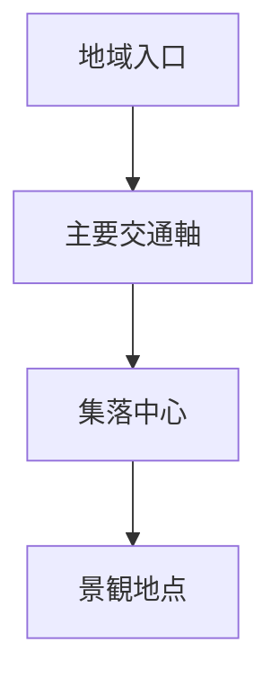
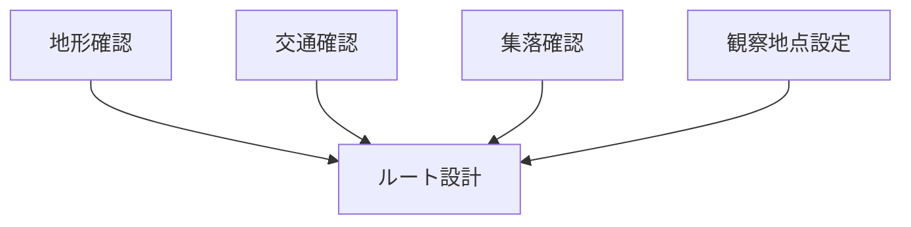
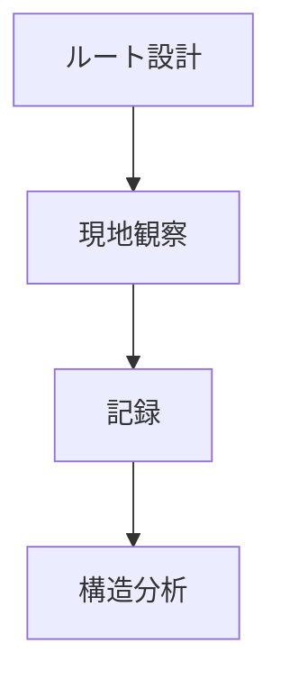

# Fieldwork Route Design（フィールドワークルート設計）

## 概要

フィールドワークルート設計とは  
**地域構造を観察できるように調査ルートを設計する方法**である。

ルート設計によって

- 観察効率
- 地域理解
- 構造把握

が大きく変わる。

---

# ルート設計の基本構造



---

# 基本ルートタイプ

## 軸ルート

都市軸・街道に沿って歩く。

例

- 商店街
- 宿場町
- メインストリート

特徴

都市構造が見える。

---

## 横断ルート

地域を横断する。

例

- 山 → 平野
- 海岸 → 内陸

特徴

地形構造が見える。

---

## 放射ルート

中心から外へ歩く。

例

- 城 → 城下町
- 駅 → 商業地区

特徴

都市構造が見える。

---

## 周回ルート

地域を一周する。

例

- 城下町
- 島
- 盆地

特徴

地域構造が見える。

---

# ルート設計フレーム



---

# 観察地点

ルートには以下を含める。

- 展望地点
- 交通拠点
- 集落中心
- 文化施設

---

# フィールドワーク質問

1 地域入口はどこか  
2 主要交通はどこか  
3 集落中心はどこか  
4 景観地点はどこか  

---

# ルート設計例

## 城下町

```
城
↓
武家地
↓
町人地
↓
寺町
```

---

## 宿場町

```
街道入口
↓
宿場中心
↓
街道出口
```

---

## 港町

```
港
↓
商業地区
↓
居住地区
```

---

# フィールドワークの流れ



---

# 関連ノート

- [[Fieldwork Execution Hub]]
- [[都市軸分析]]
- [[地域地形観察]]
- [[地域交通観察]]
- [[地域集落観察]]