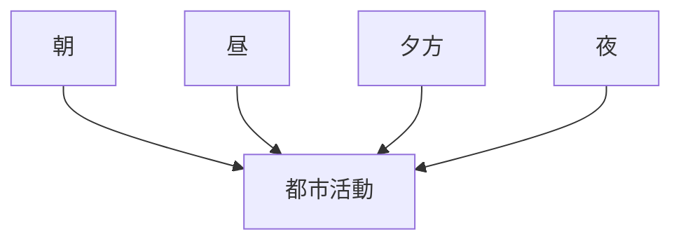

# 時間変化観察チェックリスト

## 概要

時間変化観察チェックリストとは  
**時間帯による都市活動の変化を観察するためのチェックリスト**である。

都市は

- 朝
- 昼
- 夕方
- 夜

で活動構造が変わる。

時間変化を観察することで

- 都市機能
- 商業活動
- 観光活動

を理解できる。

---

# 時間変化の基本構造

---

# 1 朝

観察項目

- 通勤
- 通学
- 開店準備

確認ポイント

- 通勤動線
- 交通量

---

# 2 昼

観察項目

- 商業
- 観光
- 飲食

確認ポイント

- 人の集中
- 商業活動

---

# 3 夕方

観察項目

- 帰宅
- 買い物

確認ポイント

- 商業ピーク
- 交通混雑

---

# 4 夜

観察項目

- 飲食
- 夜間観光

確認ポイント

- 繁華街
- 夜間活動

---

# フィールドワークでの質問

1 どの時間帯が最も活発か  
2 人の流れはどう変わるか  
3 商業はいつ活発か  

---

# 目的

- 都市活動理解  
- 商業時間理解  
- 観光時間理解  

---

# 関連ノート

- [[02_zettelkasten/01_knowledge/domain/fieldwork_tourism/04_method/07_observation/05_urban_observation/都市観察チェックリスト]]
- [[夜間景観観察チェックリスト]]