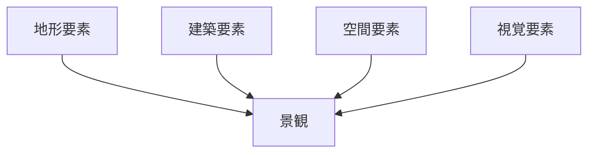
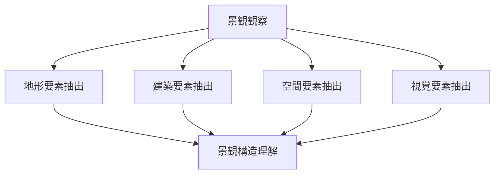

# 景観要素分解

## 概要

景観要素分解とは  
**景観を構成する要素を分解して分析する方法**である。

景観は一体として見えるが、実際には

- 地形
- 建築
- 空間構造
- 視覚要素

の組み合わせで構成されている。

この方法では景観を分解することで

- 景観構造
- 景観の意味
- 観光価値

を理解する。

---

# 景観要素の基本構造

---

# 景観要素

## 地形要素

景観の基盤。

例

- 山
- 丘
- 河川
- 海岸
- 段丘

関連ノート

- [[地形解釈]]
- [[河川分析]]
- [[都市高低差分析]]

---

## 建築要素

景観の主体。

例

- 寺社
- 城
- 町家
- 高層建築

---

## 空間要素

空間構造。

例

- 街路
- 広場
- 河岸
- 公園

関連ノート

- [[街区分析]]
- [[都市軸分析]]

---

## 視覚要素

景観の見え方。

例

- 視線
- 視界の抜け
- 景観焦点
- ランドマーク

関連ノート

- [[ランドマーク分析]]

---

# 景観要素分解の手順

---

# フィールドワーク質問

1 景観の背景は何か  
2 景観の主体は何か  
3 景観の構造はどうなっているか  
4 視線はどこに向かうか  

---

# 例

### 京都東山

地形

- 山

建築

- 清水寺
- 八坂塔

空間

- 参道

視覚

- 山を背景にした景観

---

### 金沢

地形

- 河岸段丘

建築

- 武家屋敷

空間

- 城下町街路

視覚

- 城

---

# 分析の目的

景観要素分解の目的は以下である。

- 景観構造理解  
- 観光景観理解  
- 景観評価  

---

# 関連ノート

- [[景観分析フレーム]]
- [[ランドマーク分析]]
- [[都市軸分析]]
- [[都市高低差分析]]
- [[景観観察チェックリスト]]
``