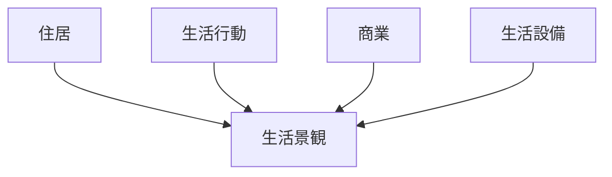
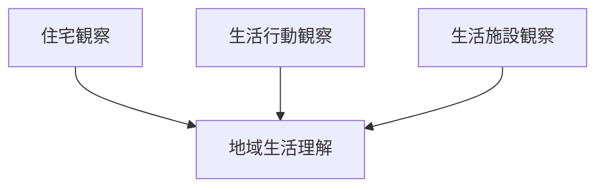

# 生活景観観察

## 概要

生活景観観察とは  
**地域住民の日常生活が表れている景観を観察する方法**である。

都市や観光地には

- 観光景観
- 生活景観

の二つが存在する。

生活景観を観察することで

- 地域文化
- 生活様式
- 地域社会

を理解できる。

---

# 生活景観の基本構造

---

# 生活景観の要素

## 住居

例

- 住宅
- アパート
- 長屋

観察ポイント

- 建築様式
- 密度
- 配置

---

## 生活行動

例

- 洗濯
- 子どもの遊び
- 近所の会話

観察ポイント

- 生活時間
- 人の活動

---

## 商業

例

- 商店
- 市場
- 個人商店

観察ポイント

- 地元利用
- 観光利用

---

## 生活設備

例

- ゴミ置き場
- 自転車
- 駐車場

観察ポイント

- 生活インフラ
- 利用状況

---

# 生活景観観察の手順

---

# フィールドワーク質問

1 住民はどのように生活しているか  
2 生活の時間帯はどうか  
3 観光景観と生活景観は分離しているか  
4 地元の生活の痕跡はどこにあるか  

---

# 例

### 京都

生活景観

- 町家
- 路地

特徴

- 生活と観光の混在

---

### 金沢

生活景観

- 武家屋敷周辺住宅

特徴

- 観光地と住宅地の共存

---

### 地方都市

生活景観

- 商店街
- 住宅街

特徴

- 地域生活中心

---

# 分析の目的

生活景観観察の目的は以下である。

- 地域文化理解  
- 生活様式理解  
- 観光と生活の関係理解  

---

# 関連ノート

- [[景観分析フレーム]]
- [[景観要素分解]]
- [[ランドマーク分析]]
- [[フィールドワークチェックリスト]]