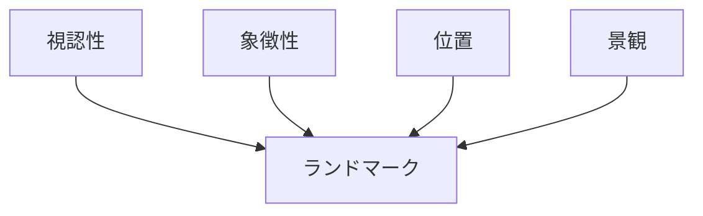
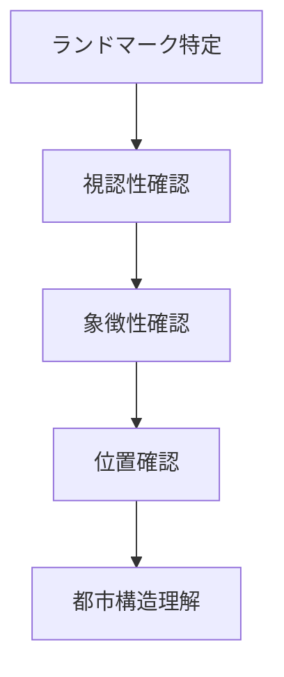

# ランドマーク分析

## 概要

ランドマーク分析とは  
**都市や地域における視覚的な目印（ランドマーク）を特定し、その意味や役割を分析する方法**である。

ランドマークは

- 都市象徴
- 空間認識
- 観光資源

として重要である。

都市では多くの場合

ランドマーク → 空間中心

となる。

---

# ランドマークの基本構造

---

# ランドマークの主なタイプ

## 建築ランドマーク

特徴

- 大きな建築
- 象徴的建物

例

- 城
- タワー
- 教会

---

## 自然ランドマーク

特徴

- 自然地形

例

- 山
- 海岸
- 岩

---

## 宗教ランドマーク

特徴

- 信仰中心

例

- 神社
- 寺院

---

## 都市ランドマーク

特徴

- 都市象徴

例

- 広場
- 記念碑

---

# ランドマーク分析の手順

---

# フィールドワークでの質問

1 この街で最も目立つ建物は何か  
2 遠くから見えるものは何か  
3 人が目印にする場所はどこか  
4 観光客が写真を撮る場所はどこか  

---

# 例

### 京都

ランドマーク

- 清水寺
- 八坂塔

特徴

- 宗教ランドマーク

---

### 金沢

ランドマーク

- 金沢城
- 兼六園

特徴

- 歴史ランドマーク

---

### 東京

ランドマーク

- 東京タワー
- スカイツリー

特徴

- 都市ランドマーク

---

# 分析の目的

ランドマーク分析の目的は以下である。

- 都市象徴理解  
- 景観構造理解  
- 観光資源理解  

---

# 関連ノート

- [[景観観察チェックリスト]]
- [[都市軸分析]]
- [[都市中心分析]]
- [[都市レイヤー]]