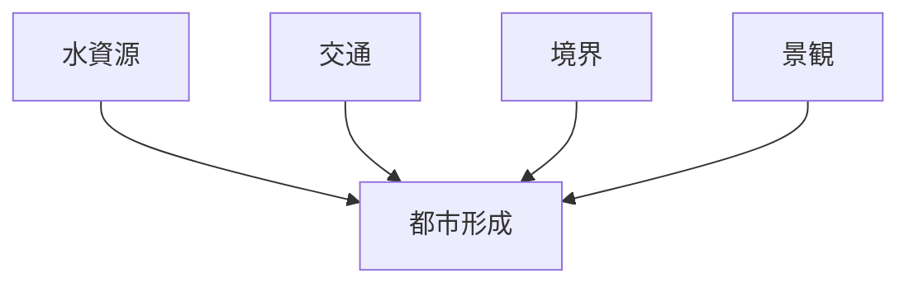
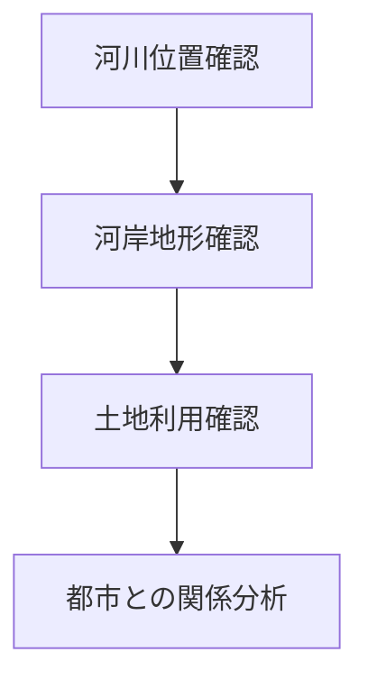

# 河川分析

## 概要

河川分析とは  
**都市や地域における河川の役割を分析する方法**である。

河川は

- 都市立地
- 交通
- 防御
- 景観

に大きな影響を与える。

多くの都市では

河川 → 都市形成

という関係が見られる。

---

# 河川の基本構造

---

# 河川の主な役割

## 水資源

特徴

- 生活用水
- 農業用水

例

- 城下町
- 農村

---

## 交通

特徴

- 船運
- 港

例

- 港町
- 河港都市

---

## 境界

特徴

- 都市境界
- 防御

例

- 城下町外堀

---

## 景観

特徴

- 河岸景観
- 観光景観

例

- 鴨川
- 隅田川

---

# 河川タイプ

## 都市河川

特徴

- 市街地を流れる

例

- 鴨川
- 隅田川

---

## 境界河川

特徴

- 都市境界

例

- 外堀

---

## 観光河川

特徴

- 景観資源

例

- 桂川
- 大堰川

---

# 河川分析の手順

---

# フィールドワーク質問

1 河川は都市のどこを流れるか  
2 河岸はどのように利用されているか  
3 河川は都市境界になっているか  
4 河川は観光資源か  

---

# 例

### 京都

河川

- 鴨川

役割

- 景観
- 都市軸

---

### 金沢

河川

- 浅野川
- 犀川

役割

- 都市境界
- 景観

---

### 江戸（東京）

河川

- 隅田川

役割

- 水運
- 商業

---

# 分析の目的

河川分析の目的は以下である。

- 都市立地理解